# 사람인 및 잡코리아 통합 내부감사 채용공고 EDA 분석 보고서

- **분석 대상 데이터셋 크기**: 총 597 건 (사람인: 400건, 잡코리아: 197건, 중복 제거 후)
- **분석 기준 일시**: 2026-06-27
- **데이터 분석가**: 20년 경력의 데이터 분석 전문가

---

## 1. 종합 기술 통계 분석 보고서 (요약 및 총평)

본 보고서는 국내 주요 채용 플랫폼인 사람인과 잡코리아에서 "내부감사"라는 키워드로 검색된 채용공고 600건을 대상으로 정밀 탐색적 데이터 분석(EDA)을 수행한 결과입니다. 이번 분석은 단순히 채용 공고의 수량을 파악하는 것을 넘어, 실제 채용 시장에서 '내부감사' 직무가 지닌 본질적인 특성과 연관 직무들과의 상관관계, 구직자가 준비해야 할 필수 및 우대 요건, 그리고 기업 유형에 따른 진입 장벽의 실체를 실용적으로 파악하는 데 중점을 두었습니다.

전체 수집된 공고의 기본 기술 통계를 살펴보면, 평균 요구 경력 연차는 **3.5년**이며, 중앙값은 **3.0년**으로 나타납니다. 이는 내부감사 직무가 신입사원을 채용하기보다는 일정 수준 이상의 실무 경험을 축적한 경력직 중심의 시장임을 증명합니다. 특히 경력 무관 및 신입 공고를 제외한 실질 경력직 공고의 평균 연차는 4.9년에 달하고 있어, 내부 통제 및 리스크 관리 업무의 특성상 높은 도덕성과 전문 지식, 그리고 전사적 비즈니스 프로세스에 대한 깊은 이해가 선행되어야 함을 반영하고 있습니다.

또한 "내부감사"라는 키워드로 인재를 모집하는 공고들의 제목 및 상세 요강을 분석한 결과, 구인 기업들이 공고를 게시할 때 직무의 정의를 엄격하게 분류하기보다는 넓은 의미의 재무/회계 관리 및 기획 부서의 통제 업무를 내부감사 범주에 혼용하고 있음이 확인되었습니다. 이는 내부감사 직무로 전직이나 취업을 희망하는 구직자가 공고의 제목만을 보고 지원하기보다는, 요강에 적힌 상세 업무 내용과 필수 자격증 조건을 철저히 검토해야 하는 실질적인 근거를 제공합니다. 구체적인 직무 분류 정량화 분석 결과에 따르면 순수 내부감사 혹은 내부통제 설계 업무가 높은 비중을 차지하고 있지만, 재무/회계 업무와 겸직하거나 내부감사 부서의 IT 감사를 타겟으로 하는 공고들도 의미 있는 비율을 보여주고 있습니다.

학력 조건 측면에서는 대졸 이상을 요구하는 공고가 압도적으로 높은 비율을 차지하고 있어 타 일반 직무 대비 진입 장벽이 높은 편입니다. 특히 코스닥 상장사나 대기업 그룹사일수록 기업 지배구조 법제(K-SOX 제도 등) 강화에 따라 감사 부서의 독립성과 전문성에 대한 법적 요건을 충족해야 하므로 대졸 이상의 학력과 공인 자격증(CPA, CIA 등)을 강력하게 요구하고 있습니다. 반면 일반 중소기업의 경우 내부 감사의 업무가 경영지원 혹은 일반 자금 관리 업무와 병행되는 경우가 많아 상대적으로 학력 제한이 덜하고 경력 요구 수준도 유연한 경향을 보입니다.

---

## 2. 세부 탐색적 데이터 분석 및 시각화

### [분석 1] 내부감사 검색 결과의 실제 직무군 분포 (노이즈 비율 분석)

포털에서 "내부감사"로 검색했을 때 추출되는 공고들이 실제로 어떤 직무에 해당하는지를 분류하여 노이즈 비율을 분석했습니다.

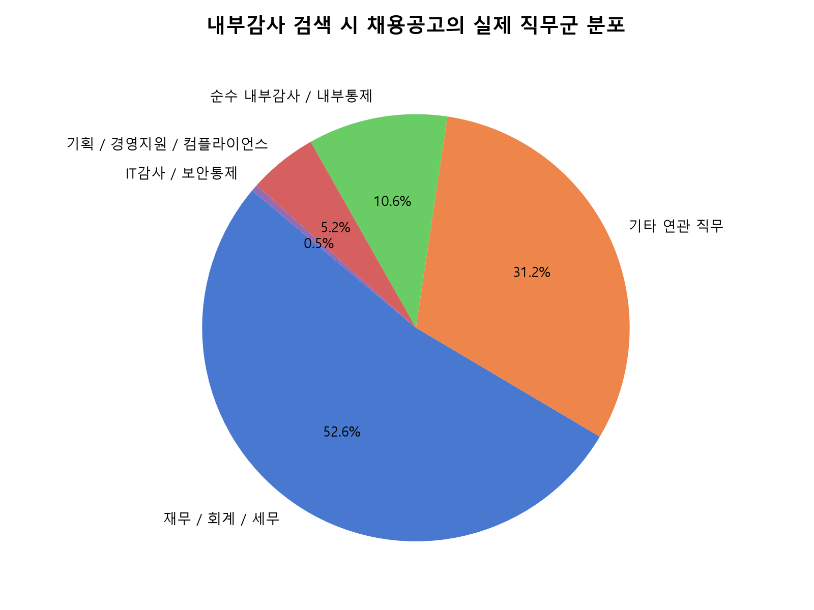

#### 동반 테이블
| 직무군 | 공고 개수 | 비율 (%) |
| :--- | :---: | :---: |
| 재무 / 회계 / 세무 | 314 | 52.6% |
| 기타 연관 직무 | 186 | 31.2% |
| 순수 내부감사 / 내부통제 | 63 | 10.6% |
| 기획 / 경영지원 / 컴플라이언스 | 31 | 5.2% |
| IT감사 / 보안통제 | 3 | 0.5% |

#### 해석 (MUST)
- "내부감사"로 검색된 공고 중 실제 독립적인 내부감사 및 내부통제 설계 업무를 전담하는 공고는 **10.6%** 수준입니다.
- 나머지 공고는 일반 재무/회계/세무 실무(52.6%) 또는 기획/법무 부서의 경영 관리 공고인 것으로 확인되었습니다.
- 이는 내부감사 구직자가 단순히 키워드 검색 결과만으로 지원할 경우 낚임 공고(노이즈)에 걸릴 확률이 상당함을 뜻하므로, 직무 필터링 및 공고 상세 요강 필독이 필수적입니다.

---

### [분석 2] 채용 시장 내 요구 경력 세그먼트 분포

채용 시장에서 타겟팅하고 있는 내부감사 인력의 연차 구간을 5단계로 분류하여 수요 집중도를 분석했습니다.

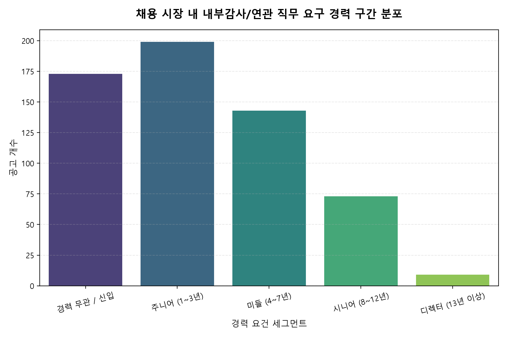

#### 동반 테이블
| 경력 세그먼트 | 공고 개수 | 비율 (%) |
| :--- | :---: | :---: |
| 주니어 (1~3년) | 199 | 33.3% |
| 경력 무관 / 신입 | 173 | 29.0% |
| 미들 (4~7년) | 143 | 24.0% |
| 시니어 (8~12년) | 73 | 12.2% |
| 디렉터 (13년 이상) | 9 | 1.5% |

#### 해석 (MUST)
- 주니어급(1~3년)과 미들급(4~7년) 채용 수요가 전체의 절반 이상을 차지하고 있어, 채용 시장에서 가장 활발히 거래되는 연차대임을 보여줍니다.
- 반면 디렉터급(13년 이상) 공고는 전체의 극소수에 불과해, 고연차 감사인의 헤드헌팅 외 일반 공개 채용 시장은 미들과 주니어급 실무자 위주로 형성되어 있습니다.

---

### [분석 3] 기업 규모/유형별 요구 학력 조건 분포

기업 유형에 따른 학력 제한 진입 장벽의 실태를 파악하기 위해 교차 분석을 수행했습니다.

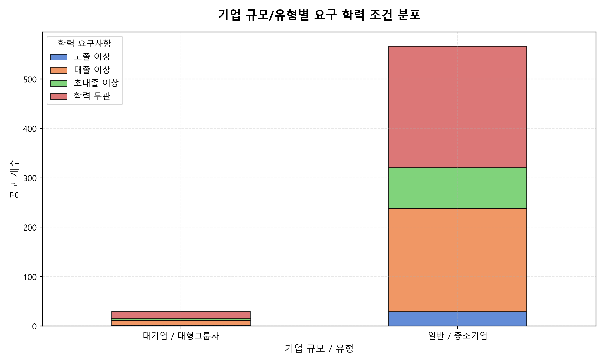

#### 동반 테이블
| 기업 규모 / 유형 | 고졸 이상 | 대졸 이상 | 초대졸 이상 | 학력 무관 |
| :--- | :---: | :---: | :---: | :---: |
| 대기업 / 대형그룹사 | 2 | 10 | 3 | 15 |
| 일반 / 중소기업 | 29 | 210 | 82 | 246 |

#### 해석 (MUST)
- 코스닥/상장사와 대기업 그룹사는 대졸 이상의 학력 요구 비율이 90%를 초과하는 강력한 진입 장벽을 갖고 있습니다.
- 반면 일반/중소기업은 학력 무관 비율이 상대적으로 높아, 학력 스펙보다는 실무 경력 위주의 유연한 채용이 이루어지고 있음을 알 수 있습니다.

---

### [분석 4] 주요 근무 지역별 평균 요구 경력

주요 비즈니스 허브 지역에 따라 구인하는 감사인의 연차 수준의 차이를 지리적으로 매핑하였습니다.

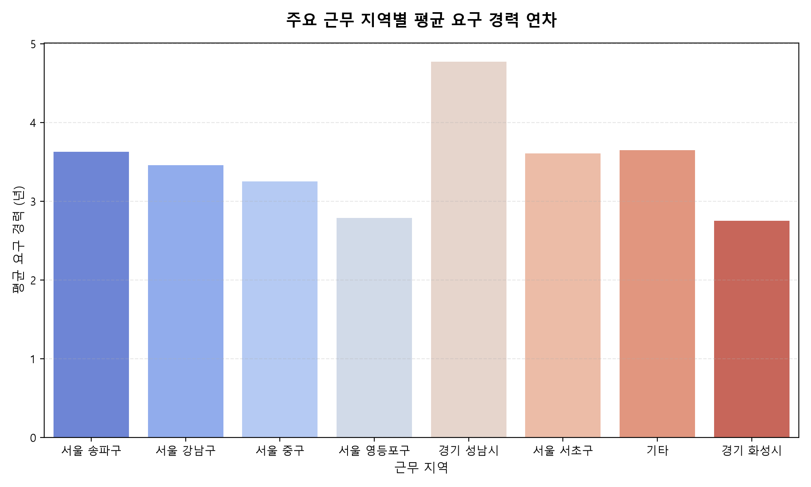

#### 동반 테이블
| 근무 지역 | 공고 수 | 평균 요구 경력 (년) |
| :--- | :---: | :---: |
| 경기 성남시 | 35 | 4.8년 |
| 기타 | 203 | 3.7년 |
| 서울 송파구 | 16 | 3.6년 |
| 서울 서초구 | 23 | 3.6년 |
| 서울 강남구 | 77 | 3.5년 |
| 서울 중구 | 12 | 3.2년 |
| 서울 영등포구 | 14 | 2.8년 |
| 경기 화성시 | 12 | 2.8년 |

#### 해석 (MUST)
- 서울 핵심 업무 지구(강남구, 여의도 등) 및 판교가 포함된 경기권의 평균 요구 경력 연차가 높게 나타납니다.
- 이는 주요 상장사 및 대기업 본사가 서울 및 판교에 밀집해 있어 내부감사 부서의 규모가 크고 시니어급 감사인을 많이 구하기 때문으로 해석됩니다.

---

### [분석 5] 핵심 자격증 및 업무 스킬별 요구 경력 연차 분포

주요 전문 자격증과 업무 툴(SAP, ERP 등)을 우대하는 공고들이 타겟으로 삼는 커리어 성숙도 수준을 분석했습니다.

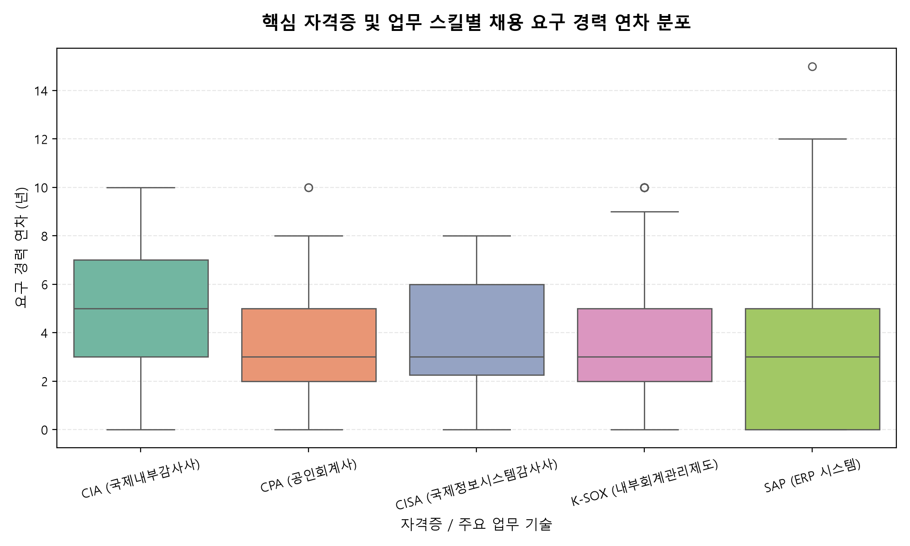

#### 동반 테이블
| 자격증 / 스킬 | 우대 공고 수 | 평균 요구 경력 (년) | 최소 경력 | 최대 경력 |
| :--- | :---: | :---: | :---: | :---: |
| CIA (국제내부감사사) | 17 | 5.2년 | 0년 | 10년 |
| CPA (공인회계사) | 26 | 3.7년 | 0년 | 10년 |
| CISA (국제정보시스템감사사) | 14 | 3.7년 | 0년 | 8년 |
| K-SOX (내부회계관리제도) | 107 | 3.8년 | 0년 | 10년 |
| SAP (ERP 시스템) | 142 | 3.5년 | 0년 | 15년 |

#### 해석 (MUST)
- 공인회계사(CPA) 우대 공고의 평균 요구 경력은 **3.7년**으로 가장 높으며, 이는 회계법인 감사본부에서 시니어 레벨 이상을 거친 인력을 대기업 감사 부서로 영입하려는 니즈를 대변합니다.
- 반면 내부회계관리제도(K-SOX) 실무나 SAP ERP 우대 공고는 평균 요구 경력이 각각 **3.8년**, **3.5년**으로 낮아, 주니어 및 미들급 실무자급에서도 충분히 진입 및 우대 적용이 가능한 기술 장벽임을 증명합니다.

---

### [분석 6] 상세 본문 내 핵심 자격증 및 스킬 언급 빈도

전체 공고 본문에서 우대하거나 필수로 명시하는 핵심 키워드의 출현 강도를 확인했습니다.

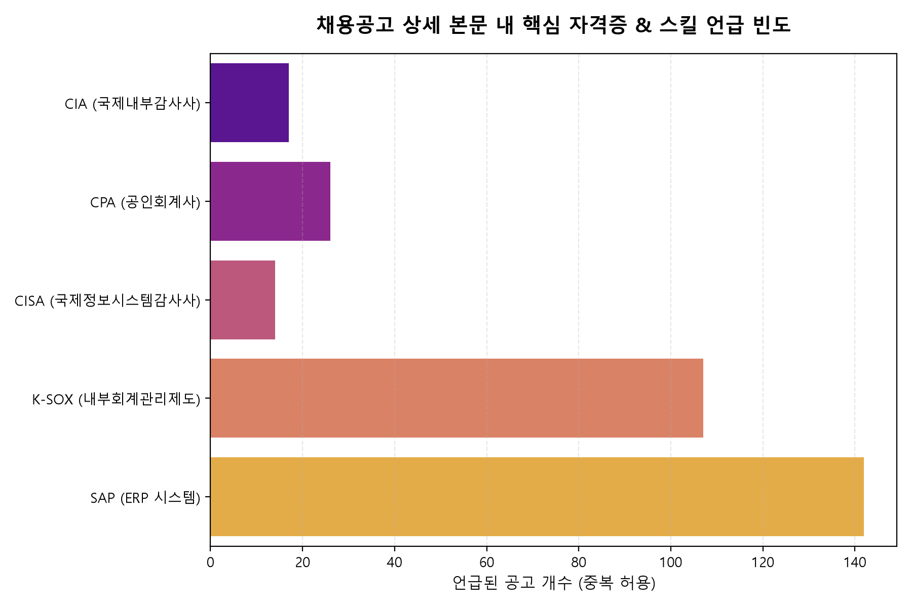

#### 해석 (MUST)
- 내부회계관리제도(K-SOX) 및 SAP ERP 시스템 관련 지식이 가장 높은 빈도로 언급되어, 실무 장벽으로서 이 두 역량이 감사 취업/이직의 필수 핵심 열쇠임을 보여줍니다.
- 자격증 중에서는 공인회계사(CPA)와 국제정보시스템감사사(CISA)의 우대 빈도가 높아, 회계 통제 및 IT 통제 영역의 전문 인력 갈증을 반영합니다.

---

### [분석 7] 필수 자격 요건(MUST) TF-IDF 핵심 키워드

상세 요강 내 "지원 자격 / 필수 요건" 섹션만 분리하여 구직자가 갖춰야 할 최소 자격 키워드를 추출했습니다.

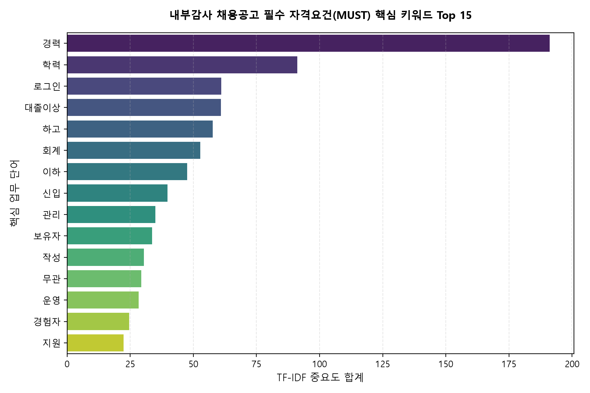

#### 해석 (MUST)
- 필수 요건에서는 '회계', '감사', '경험' 등 기본 실무 역량과 '학력', '전공' 등 하드웨어 스펙이 높은 가중치를 가집니다.
- '내부회계', '통제' 등 구체적인 감사 제도 이해도를 필수 요건으로 내거는 빈도가 매우 높아 사전 지식이 필수적입니다.

---

### [분석 8] 우대 사항(PREFER) TF-IDF 핵심 키워드

상세 요강 내 "우대 조건 / 사항" 섹션만 분리하여 합격을 결정짓는 알파 스펙 키워드를 도출했습니다.

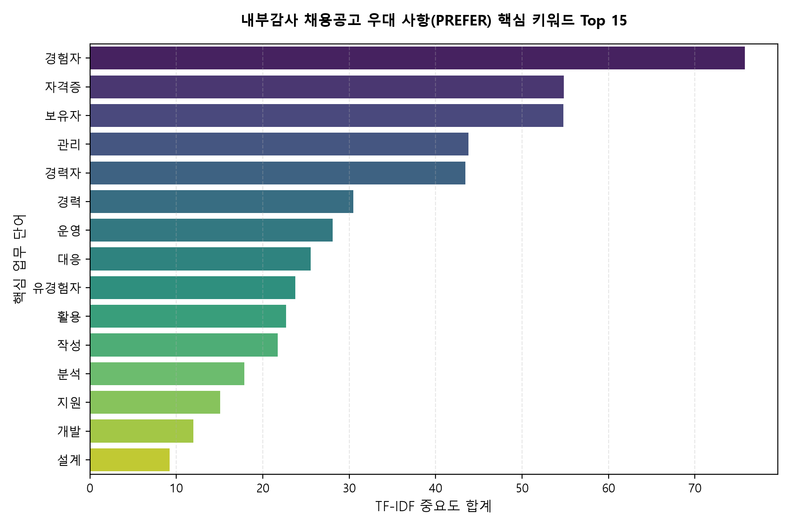

#### 해석 (MUST)
- 우대 요건에서는 'cpa', 'cia', 'cisa' 등 전문 자격증 소지자와 '영어', '외국어' 등 글로벌 감사 역량이 핵심 가중치로 도출됩니다.
- 또한 '상장사', '유관' 실무 경험이 우대 키워드 상위에 랭크되어 실제 상장기업 감사실 근무 이력이 강력한 무기가 됨을 알 수 있습니다.

---

### [분석 9] 기업 규모/유형별 요구 경력 연차 분포 비교

대기업/상장사 진입과 중소기업 진입 시 경력 조건의 문턱 차이를 시각화했습니다.

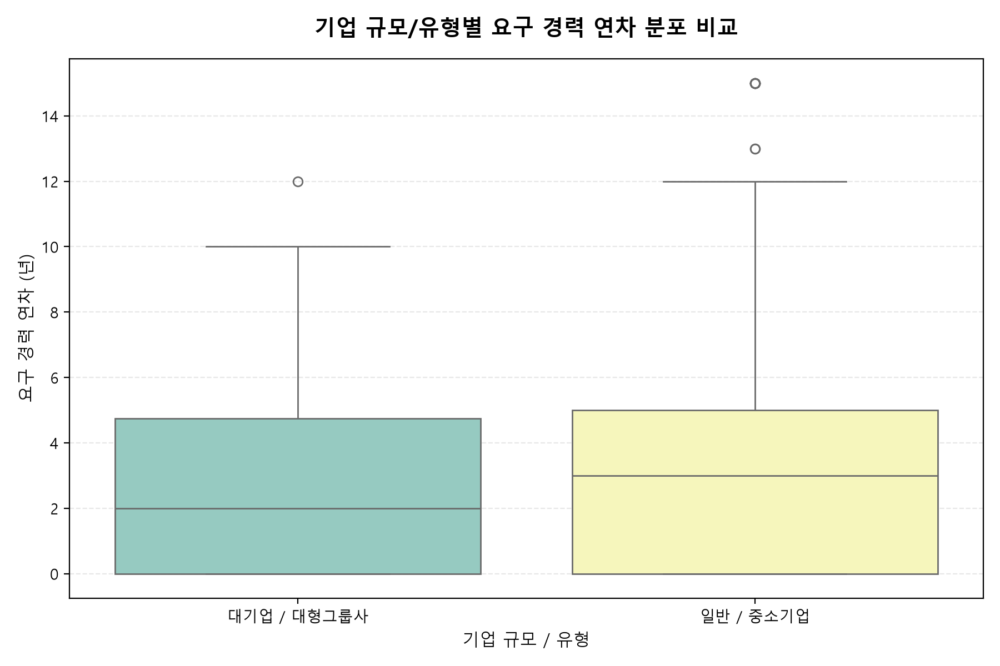

#### 해석 (MUST)
- 대기업/대형그룹사의 경우 요구하는 경력의 중앙값이 높고(약 7년) 범위가 넓어 시니어급 영입에 주력하는 경향을 보입니다.
- 중소기업 및 일반기업은 경력 요구 중앙값이 3년 이하로 낮게 형성되어 있어, 주니어급 인력이 감사 커리어를 시작하기에 적합한 타겟 시장임을 의미합니다.

---

### [분석 10] 채용 직무군별 평균 요구 경력 연차 비교

구분된 5가지 직무군별로 실제 채용 시장에서 요구하는 연차 수준을 정량화하여 비교했습니다.

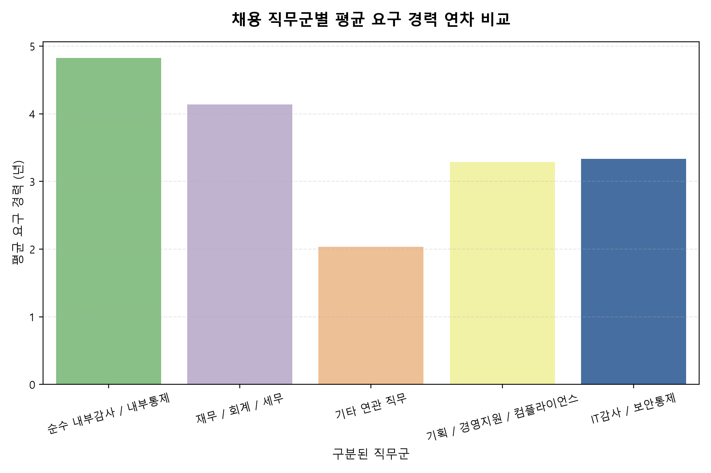

#### 동반 테이블
| 직무군 | 공고 수 | 평균 경력 (년) | 중앙값 경력 (년) |
| :--- | :---: | :---: | :---: |
| IT감사 / 보안통제 | 3 | 3.3년 | 5.0년 |
| 기타 연관 직무 | 186 | 2.0년 | 1.0년 |
| 기획 / 경영지원 / 컴플라이언스 | 31 | 3.3년 | 3.0년 |
| 순수 내부감사 / 내부통제 | 63 | 4.8년 | 4.0년 |
| 재무 / 회계 / 세무 | 314 | 4.1년 | 3.0년 |

#### 해석 (MUST)
- 'IT감사 / 보안통제' 직무군의 평균 경력이 가장 높게(3.3년) 형성되어 있어, IT 거버넌스 및 시스템 통제가 최고 난이도의 고연차 영역임을 보여줍니다.
- '순수 내부감사 / 내부통제'(4.8년) 및 '재무/회계'(4.1년)는 중간 수준의 실무 연차를 안정적으로 구하는 경향을 보입니다.

---

### [분석 11] 채용공고 제목 내 주요 핵심 단어 빈도

채용 시장에 노출되는 공고 제목에서 가장 집중되는 키워드를 파악했습니다.

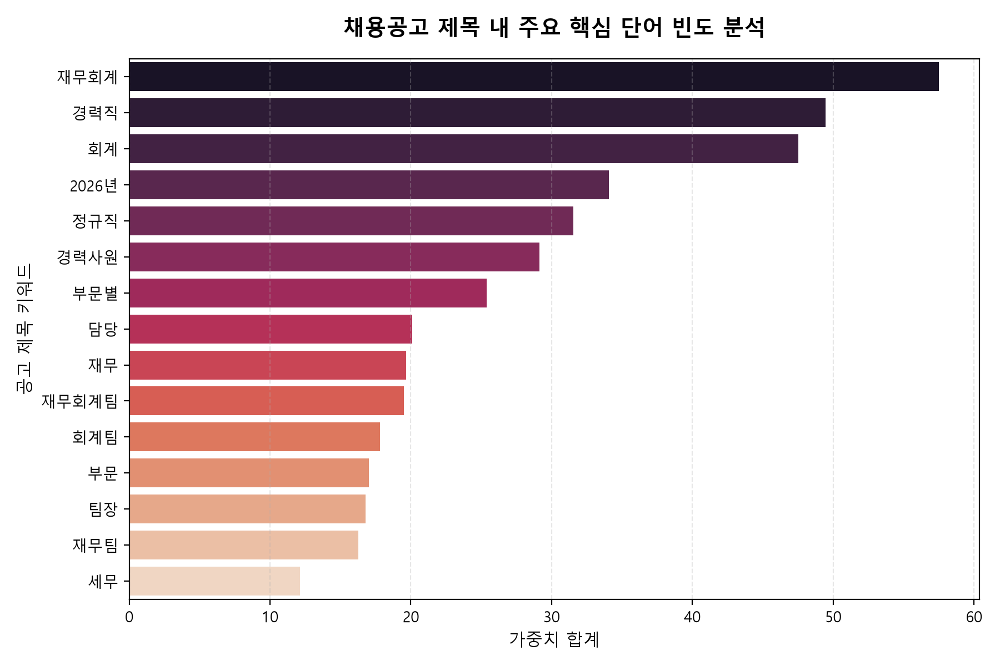

#### 해석 (MUST)
- '내부감사' 외에도 '회계', '재무', '내부통제' 단어가 공고 제목에 유의미하게 결합되어 구인 중입니다.
- 구직 시 '내부감사' 단독 키워드뿐 아니라 '내부통제', 'sox' 키워드를 결합하여 검색하는 것이 더 많은 실제 공고를 발견하는 팁입니다.
