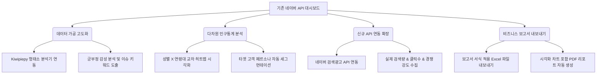

# 네이버 API 종합 분석 대시보드 기능 및 비즈니스 개선 기획서

본 기획서는 현재 구축된 '네이버 API 종합 분석 대시보드'의 기능 구현 상태를 분석하고, 대시보드의 비즈니스적 가치와 데이터 활용도를 극대화하기 위한 기능 개선 및 전략적 확장 방안을 제안합니다.

---

## 1. 프로젝트 개요 및 배경

본 프로젝트는 네이버가 제공하는 다양한 오픈 API(검색 트렌드, 쇼핑 트렌드, 쇼핑 상품 검색, 블로그, 카페, 뉴스 등)를 단일 웹 인터페이스에서 통합하여 조회하고 분석할 수 있는 **Streamlit 기반 종합 대시보드**입니다.

현재 대시보드는 네이버 오픈 API로부터 원천 데이터를 정상적으로 수집하고 기초적인 시각화(라인 차트, 파이 차트, 박스 플롯 등)를 제공하는 수준입니다. 그러나 기업 마케터, 이커머스 MD, 전략 기획자 등 실무 사용자가 본 도구를 통해 **구체적인 마케팅 의사결정을 내리고 실행 가능한 인사이트(Actionable Insight)를 도출**하기에는 다음과 같은 고도화 작업이 필요합니다.

- **단순 데이터 나열의 한계 탈피**: 수집된 텍스트 및 수치 데이터의 2차 가공을 통한 인사이트 자동 도출
- **타겟 세분화**: 성별, 연령별 단순 필터링을 넘어선 다차원 교차 분석 지원
- **키워드 확장성**: 사용자가 입력한 키워드 이외의 시장 트렌드를 발굴하기 위한 연관어/추천 기능 연동
- **비즈니스 활용성**: 분석 결과를 외부 및 유관 부서에 즉시 공유할 수 있는 보고서 출력 기능

이에 따라 본 기획서는 기존 시스템의 현황을 철저히 검토하고, 비즈니스 가치를 극대화할 수 있는 구체적인 기능 개선 요구사항 및 비즈니스 시나리오를 정의합니다.

---

## 2. 기존 대시보드 현황 분석 (As-Is)

현재 구축되어 있는 `naver-api-app` 프로젝트의 폴더 구조와 주요 파일의 역할 및 제공 기능은 다음과 같습니다.

### 2.1. 폴더 구조 및 구성 요소
- `naver-api-app/run_dashboard.py`: Windows 환경의 Streamlit 자격 증명 파일 쓰기 권한 오류를 방지하기 위한 모킹(Mocking) 및 포트 설정(`8502`) 후, 실질적인 대시보드 앱인 `src/app.py`를 실행하는 진입점입니다.
- `naver-api-app/src/app.py`: 사이드바를 활용하여 사용자로부터 네이버 API Client ID/Secret을 입력받고(또는 `.env` 및 `st.secrets`에서 자동 로드), 공통 검색 키워드(쉼표 구분)와 분석 날짜 범위를 정의하여 전체 페이지에 공유하는 메인 엔트리 페이지입니다. `st.navigation`을 통해 멀티페이지 구성을 구현했습니다.
- `naver-api-app/src/api_client.py`: 네이버 API 명세에 맞춰 HTTP GET/POST 통신을 처리하고, 발생 가능한 400, 401, 403, 429, 500 오류에 대해 직관적인 한국어 에러 메시지를 화면에 반환하는 역할을 전담합니다.
- `naver-api-app/src/pages/`: 각 도메인별 분석을 수행하는 Streamlit 페이지 파일들입니다.

### 2.2. 페이지별 제공 기능 상세
1. **통합 키워드 상세 분석 (`integrated_analysis.py`)**
   - **기능**: 사용자가 설정한 여러 키워드 중 1개를 선택하여 해당 키워드에 관한 트렌드, 블로그, 카페, 뉴스, 쇼핑 데이터를 한 화면에 탭(Tab) 레이아웃으로 결합해 보여줍니다.
   - **데이터 활용**: 블로그 데이터에서 HTML 태그를 제거한 뒤 명사를 추출하여 빈도 순위 바 차트를 표출하며, 쇼핑 데이터의 최저/최고/평균가 통계 및 상위 5개 판매처 점유율(원 그래프)을 시각화합니다.
2. **통합 검색어 트렌드 (`trend.py`)**
   - **기능**: 입력된 다수 키워드 간의 상대적인 검색량 변화를 시계열 라인 차트로 비교합니다.
   - **데이터 활용**: 평균 비율, 중앙값 비율, 최대 비율 및 발생일, 그리고 변동계수(CV, Coefficient of Variation)를 계산하여 표 형식으로 제공합니다. 피벗 테이블 원본 데이터 보기와 CSV 다운로드를 지원합니다.
3. **쇼핑 검색어 트렌드 (`shopping_trend.py`)**
   - **기능**: 네이버 쇼핑인사이트 API를 활용하여, 특정 카테고리(도서 카테고리가 기본값으로 설정됨) 내에서 키워드 간의 상대적 클릭 비율 추이를 시계열로 분석합니다.
   - **데이터 활용**: 성별, 기기유형(PC/모바일), 연령대(10대~60대) 필터를 지원하며, 평균/최대 클릭 비율 통계 및 원본 피벗 데이터의 CSV 다운로드를 제공합니다.
4. **쇼핑 상품 검색 및 가격 분석 (`shopping_search.py`)**
   - **기능**: 특정 키워드로 네이버 쇼핑 검색 API를 호출하여 상품 목록을 수집하고 가격 분포를 파악합니다.
   - **데이터 활용**: Box Plot 및 Histogram을 그려 가격 분포 범위와 통계적 이상치(IQR 1.5배 기준) 개수를 식별해 줍니다. 상위 10개 브랜드의 원 그래프, 상위 10개 판매처의 가로 바 차트를 렌더링하고, 이미지 썸네일을 포함한 상품 리스트 표출 및 CSV 다운로드를 지원합니다.
5. **개별 검색 분석 (`blog.py`, `cafe.py`, `news.py`)**
   - **기능**: 네이버 블로그, 카페글, 뉴스 API 검색 결과를 개별적으로 호출하여 검색 옵션(유사도순/날짜순, 수집 개수)에 맞게 정렬된 목록을 보여주고 원본 텍스트를 파싱하여 제공합니다.

### 2.3. 기존 구현의 한계점
- **심층적 분석 부재**: 형태소 분석이 단순 정규식과 한국어 조사/어미 중심의 간단한 불용어(Stopwords) 제거로만 구성되어 있어, 문맥이 배제된 채 '진짜', '너무'와 같은 단어가 핵심 키워드로 등장하는 등 텍스트 분석 품질이 떨어집니다.
- **연관어 발굴 한계**: 오직 사용자가 직접 브레인스토밍하여 입력한 키워드만 분석할 수 있으므로, 사용자가 인지하지 못한 신규 키워드나 연관 검색 트렌드를 파악하기 어렵습니다.
- **다차원 분석의 단편성**: 쇼핑 트렌드 등에서 연령과 성별을 각각 따로 필터링할 수는 있으나, "20대 여성은 이 상품을 사고, 40대 남성은 저 상품을 산다"와 같이 인구통계학적 세그먼트 간의 교차(Cross) 트랙션을 한눈에 입체적으로 비교하는 시각화가 부족합니다.
- **보고서 양식의 부재**: 데이터 테이블의 CSV 다운로드만 지원할 뿐, 분석 결과를 상사나 광고주에게 즉시 제출할 수 있는 시각적 보고서 형태로 내보내지 못합니다.

---

## 3. 기능 개선 기획안 (To-Be)

비즈니스 가치와 데이터의 유용성을 극대화하기 위해 다음과 같은 4가지 핵심 방향으로 기능 개선을 기획합니다.



### 3.1. [데이터 가공] 텍스트 마이닝 고도화 및 감성 분석 기능
- **기능 개요**: 블로그, 카페글, 뉴스 검색 결과로 수집되는 텍스트(제목 및 본문 요약)에 대해 보다 정교한 한국어 자연어 처리(NLP)를 적용하고 가치를 도출합니다.
- **상세 기능 요구사항**:
  - **정교한 형태소 분석**: 가볍고 성능이 뛰어난 Python 한국어 형태소 분석기 라이브러리(예: `kiwipiepy`)를 백엔드에 연동하여 무의미한 단어를 걸러내고 의미 있는 명사, 형용사, 동사 중심의 핵심 키워드를 추출합니다.
  - **긍/부정 감성 분류**: 수집된 텍스트 데이터의 맥락을 분석하여 긍정/부정/중립 반응의 비율을 계산하고, 감성 비율 파이 차트 및 게이지 차트로 표현합니다.
  - **감성별 주요 단어 비교**: 긍정 텍스트에서 주로 언급되는 긍정 요인 단어(예: '가성비', '가볍다', '튼튼하다')와 부정 텍스트의 부정 요인 단어(예: '불만족', '느리다', '비싸다')를 분리하여 상호 비교하는 바 차트나 워드클라우드를 렌더링합니다.
- **비즈니스적 기대 효과**: 브랜드 관리자는 자사 및 경쟁사 제품에 대한 소비자 피드백의 핵심 원인을 원클릭으로 요약 파악할 수 있으며, 부정 여론에 대한 선제적 모니터링이 가능해집니다.

### 3.2. [다차원 분석] 연령별·성별 크로스 타겟팅 분석
- **기능 개요**: 데이터랩의 성별, 연령대 클릭 데이터를 2차원 매트릭스로 결합하여 주력 타겟층을 한눈에 정의하는 '크로스 세그먼테이션(Cross-Segmentation)' 뷰를 구축합니다.
- **상세 기능 요구사항**:
  - **성별 X 연령대 반응 히트맵**: 세로축에는 연령대(10대~60대), 가로축에는 성별(남성, 여성)을 배치하고, 각 셀의 밝기나 색상 농도로 클릭 강도를 시각화하는 히트맵(Heatmap)을 도입합니다.
  - **타겟 페르소나 자동 분석**: 분석 결과를 기반으로 "본 키워드의 핵심 소비층은 **30대 여성(클릭 비중 42%)** 및 **20대 여성(28%)**으로, 전체의 70%를 차지하는 여성 중심의 트렌드 상품입니다"와 같은 텍스트 기반의 자동 요약 인사이트 카드를 생성합니다.
- **비즈니스적 기대 효과**: 신제품 타겟팅 광고 집행 시 매체 믹스(Media Mix) 및 광고 도달 연령/성별을 극도로 정교화하여 마케팅 예산 대비 효율(ROI)을 높일 수 있습니다.

### 3.3. [기능 확장] 네이버 검색광고 API 연동을 통한 연관 키워드 분석
- **기능 개요**: 사용자가 입력한 키워드뿐만 아니라 네이버 광고 시스템에서 제공하는 연관 키워드 추천 API를 활용하여 확장 검색량과 광고 지표를 동시에 분석합니다.
- **상세 기능 요구사항**:
  - **연관 키워드 추출**: 입력 키워드와 관련된 상위 20개 연관 키워드를 수집합니다.
  - **실제 수치 매핑**: 네이버 오픈 API의 '상대 지수(최대 100)' 한계를 보완하기 위해, 네이버 검색광고 API (`https://api.naver.com/keywordstool`)를 통해 각 키워드의 **실제 월간 검색수(PC/모바일)**, **월간 클릭수**, **평균 클릭률(CTR)**, **경쟁 정도(높음/중간/낮음)**를 테이블로 조회합니다.
  - **틈새 키워드 추천 필터**: 검색량은 5,000회 이상으로 높으나 경쟁 정도가 '낮음' 또는 '중간'인 키워드를 자동으로 필터링해주는 'MD 추천 키워드' 탭을 제공합니다.
- **비즈니스적 기대 효과**: 이커머스 MD는 스마트스토어 상품 등록 시 노출률을 극대화할 수 있는 블루오션 키워드를 발견할 수 있으며, 광고 담당자는 입찰 경쟁이 낮은 알짜 키워드를 사전에 확보할 수 있습니다.

### 3.4. [출력 기능] 고품질 Excel 및 PDF 보고서 내보내기 (Export)
- **기능 개요**: 대시보드에서 분석한 결과 화면과 통계 테이블을 격식 있는 보고서 서식으로 변환하여 로컬 파일로 저장하는 기능을 구현합니다.
- **상세 기능 요구사항**:
  - **Excel 보고서 다변화**: 단순 CSV 형식을 탈피하여 분석 요약 시트, 검색 트렌드 시트, 쇼핑 상품 목록 시트 등 탭별로 구분되고 표 스타일(셀 배경색, 볼드 처리, 숫자 세 자리 콤마 포맷 등)이 적용된 정형화된 Excel 파일(`.xlsx`)을 내보냅니다.
  - **PDF 리포트 생성**: 대시보드의 현재 핵심 차트 이미지들과 주요 요약 인사이트 텍스트를 A4 사이즈 양식에 맞춰 배치한 '종합 시장 동향 리포트' PDF 파일을 실시간 생성하여 다운로드할 수 있게 합니다.
- **비즈니스적 기대 효과**: 마케터가 보고자료 작성을 위해 차트를 캡처하고 표를 다시 파워포인트나 워드로 옮기는 단순 반복 업무 시간을 90% 이상 절감할 수 있습니다.

---

## 4. 비즈니스적 장단점 및 사용자 요구 시나리오

개선 기획안을 실행할 때 고려해야 하는 시스템/비즈니스 관점의 장단점(Trade-Off)과 실제 업무 현장에서의 가상 시나리오를 설계합니다.

### 4.1. 비즈니스적 장단점 (Trade-Off)

| 분석 차원 | 장점 (Benefits) | 단점 및 제약사항 (Constraints & Risks) | 대응 방안 (Mitigation Strategies) |
| :--- | :--- | :--- | :--- |
| **API 호출 한도** | 다양한 세부 조건 분석을 통해 맞춤형 마케팅 전략 수립 가능 | 네이버 오픈 API의 일일 호출 한도(검색 API 25,000회 등)를 초과하여 대시보드가 마비될 위험성 존재 | SQLite와 같은 경량 로컬 DB나 파일 캐싱을 도입하여 당일 이미 조회된 동일 키워드 요청은 API 호출 없이 캐시를 반환하도록 설계 |
| **검색광고 API 연동** | 실제 월간 검색량 및 클릭수 데이터를 기반으로 구체적인 예산 수립 가능 | 검색광고 API는 별도의 Access License 키가 필요하며, 헤더 서명(SHA256 HMAC) 암호화 로직이 복잡해 사용자 초기 설정 허들이 존재 | 사이드바에 광고 API 인증키 입력을 옵션(Optional) 항목으로 배치하고, 설정되지 않았을 때는 오픈 API 기반 분석 기능만 표시하는 Fallback 로직 적용 |
| **자연어 처리 (NLP)** | 텍스트 이면의 소비자 감성과 여론 트렌드를 정교하게 분석 | 형태소 분석기 라이브러리(Java 기반 Konlpy 등) 설치 시 시스템 환경별 종속성 오류가 발생하기 쉬움 | Java 설치가 필요 없는 Pure-Python 기반의 `kiwipiepy`나 단순 형태소 분리기를 채택하여 멀티 OS(Windows, Linux, macOS) 설치 안정성 확보 |
| **보고서 출력 (PDF)** | 대외 보고 및 클라이언트 제출용 리포트 작성 업무 효율화 | PDF 라이브러리(ReportLab 등) 사용 시 한글 폰트 깨짐 문제 및 차트 이미지 변환 과정에서의 렌더링 지연 발생 | 프리렌더링된 차트 이미지를 파일로 저장한 뒤 PDF 템플릿에 매핑하고, 나눔고딕 등 무료 한글 폰트를 앱 패키지에 기본 내장하여 배포 |

### 4.2. 사용자 요구 시나리오

#### 시나리오 A: 이커머스 쇼핑몰 MD의 신제품 기획 및 키워드 소싱
- **페르소나**: 패션/잡화 쇼핑몰을 운영하는 상품 기획 및 소싱 담당 MD 김 과장
1. **문제 상황**: 다가오는 캠핑 시즌을 대비하여 '캠핑 의자' 카테고리에 신상품을 등록하려 하지만, 대형 브랜드와의 경쟁을 피해 어떤 세부 키워드를 상품명으로 채택하고 어떤 연령대를 타겟팅해야 할지 확신이 없음.
2. **대시보드 활용**:
   - 사이드바에 '캠핑의자, 감성의자, 폴딩체어' 키워드를 입력하고 '쇼핑 검색어 트렌드'로 진입.
   - **연령별/성별 교차 분석**을 통해 '감성의자' 키워드가 특히 **20-30대 여성**층에서 클릭 비율이 주말에 급증하는 패턴을 확인.
   - '연관 키워드 추천' 탭을 활성화하여 네이버 검색광고 API로부터 실제 검색수 조회. '감성 릴렉스 체어'라는 키워드가 월 검색량 8,000회에 경쟁 강도가 '낮음'임을 포착.
   - '쇼핑 상품 가격 분석'을 통해 가격대의 50%가 3만 원에서 5만 원 사이에 분포(IQR 범위)함을 파악하여 신제품의 판매 가격을 39,900원으로 책정.
3. **결과**: MD 김 과장은 도출된 시각 자료와 가격 포지셔닝 맵을 'Excel 보고서 내보내기'로 다운받아 상품 기획 품의서에 즉시 첨부하고 소싱 계약을 승인받음.

#### 시나리오 B: 홍보 대행사 마케터의 바이럴 캠페인 성과 측정
- **페르소나**: 화장품 브랜드의 인플루언서 바이럴 캠페인을 대행하는 AE 이 대리
1. **문제 상황**: 지난 2주간 진행한 신규 수분크림의 블로그/카페 협찬 이벤트가 실제로 긍정적인 여론을 형성했는지, 소비자들의 주요 관심 키워드는 무엇으로 변화했는지 종합하여 클라이언트(브랜드사)에게 성과 보고를 해야 함.
2. **대시보드 활용**:
   - 대시보드에 브랜드 신제품 키워드인 'OO 수분크림'을 입력.
   - '통합 키워드 상세 분석'의 **블로그 리뷰 분석 및 감성 분석** 탭 확인.
   - 형태소 분석기를 거쳐 정제된 긍부정 분류 차트에서 긍정 지수가 캠페인 전 62%에서 캠페인 후 88%로 상승했음을 입증.
   - 긍정 리뷰에서 '수분감', '밀착력', '순하다' 등이 핵심 단어로 등장하고, 부정 리뷰에서는 '용량', '스파출러 부재'가 언급됨을 포착.
   - '통합 검색 트렌드'를 통해 바이럴 집행 기간 동안 검색 상대지수가 평균 15에서 65로 대폭 상승했음을 그래프로 확인.
3. **결과**: 이 대리는 이 모든 지표가 정리된 '종합 시장 분석 PDF 보고서'를 단 5초 만에 출력하여, 별도의 수작업 보고서 작성 없이 클라이언트 정기 미팅에서 바이럴 성과를 입증함.

---

## 5. 단계별 개발 로드맵

제안된 개선안들을 리소스와 구현 난이도에 따라 3단계로 나누어 단계적으로 추진합니다.

```
[1단계: MVP 고도화] -------------------> [2단계: 지능화 & API 확장] --------> [3단계: 플랫폼화 & 최적화]
- 가격 IQR 분석 필터링 강화           - Kiwipiepy 형태소 분석기 도입      - PDF 보고서 자동화 엔진 탑재
- Excel 서식 다운로드 연동            - 네이버 검색광고 API 완벽 연동       - SQLite 기반 로컬 데이터 캐시 구축
- UI 개선 및 차트 테마 통일          - 성별/연령대 크로스 히트맵 구현    - 일일 한도 초과 방지 시스템 적용
```

1. **1단계 (단기 - MVP 및 기초 편의성 개선)**
   - 쇼핑 상품 검색 분석 내 가격 이상치(IQR)의 상세 정보 필터링 기능 강화.
   - `pandas`와 `openpyxl`을 연동하여 서식이 들어간 Excel(`.xlsx`) 파일 다운로드 기능 우선 배포.
   - 차트 레이아웃의 마진 조정 및 일관된 컬러 팔레트 적용으로 대시보드 시각화 완성도 제고.
2. **2단계 (중기 - 분석 알고리즘 고도화 및 광고 API 확장)**
   - `kiwipiepy` 라이브러리를 연동하여 블로그/카페 원문 요약 텍스트의 형태소 분석 엔진 구축 및 긍부정 사전 기반 감성 스코어링 추가.
   - 네이버 검색광고 API 연동 클래스를 `src/api_client.py`에 추가 구현하고, 사이드바 비밀번호 폼을 통해 인증 정보 수집.
   - 성별과 연령대를 교차한 다차원 히트맵 시각화 모듈 구축.
3. **3단계 (장기 - 자동 보고서 생성 및 데이터 적재 최적화)**
   - ReportLab 또는 HTML-to-PDF 변환 엔진을 활용해 대시보드 뷰를 그대로 반영한 고품질 PDF 보고서 템플릿 제작 및 다운로드 연동.
   - 로컬 SQLite 데이터베이스를 탑재하여 한 번 조회한 키워드의 트렌드 데이터를 일간 단위로 보존하고 재활용함으로써 네이버 API 호출 제한 극복 및 속도 최적화.

---

## 6. 결론

본 기능 개선 기획안은 기존의 네이버 API 종합 분석 대시보드를 단순한 '데이터 조회용 유틸리티'에서 기업의 실질적인 **'시장 탐색 및 전략 수립 플랫폼'**으로 진화시키는 것을 목표로 합니다. 

데이터 가공의 고도화(NLP 감성 분석), 다차원 인구통계 분석(성별/연령 크로스 히트맵), 연관 정보 융합(검색광고 API 연동), 그리고 실무 최적화 아웃풋(PDF/Excel 보고서 내보내기)의 구현을 통해 대시보드의 비즈니스 가치와 데이터 활용도를 혁신적으로 높일 수 있을 것으로 기대됩니다.
