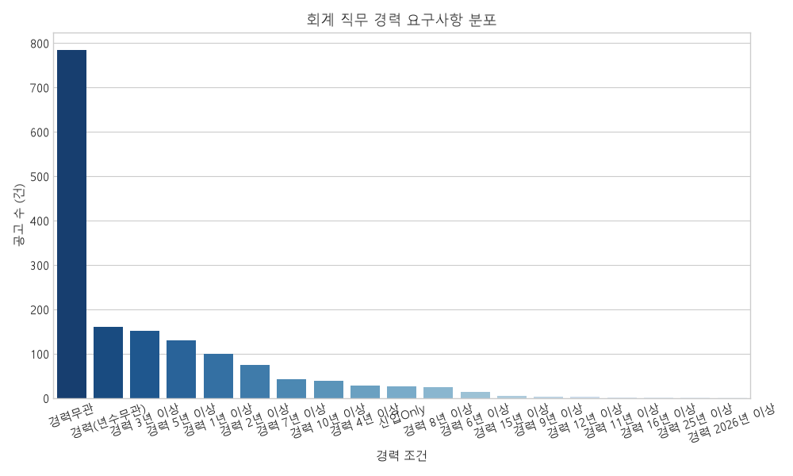
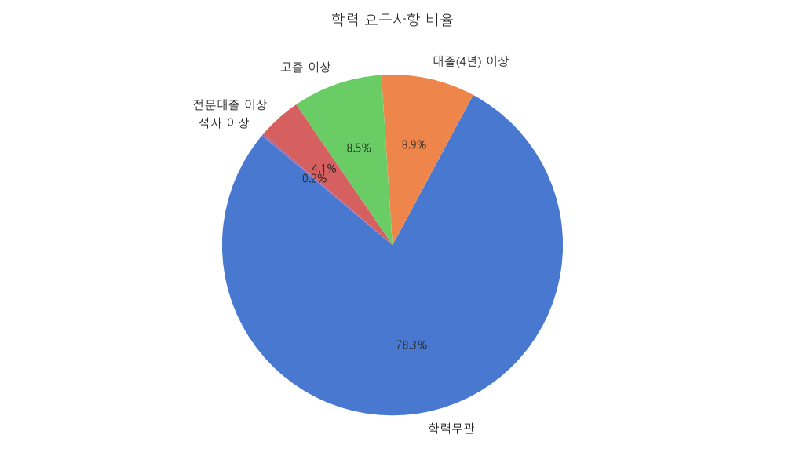
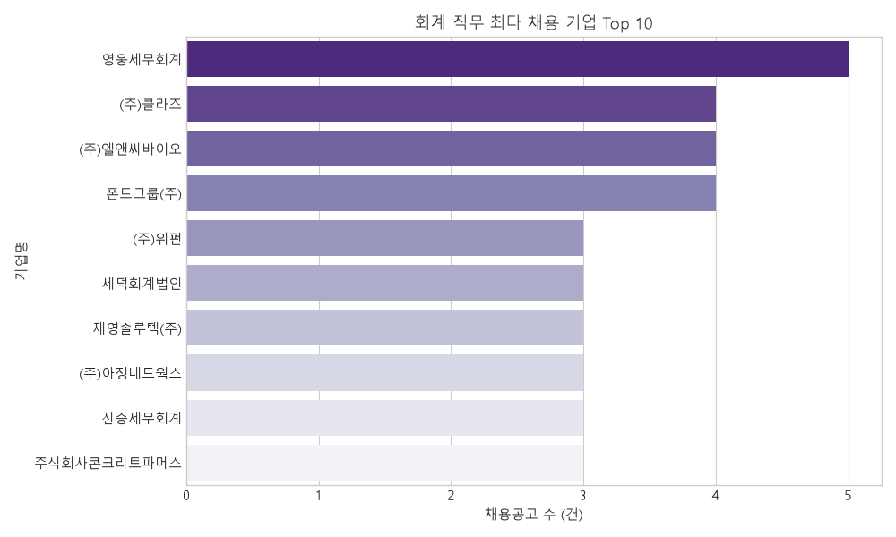
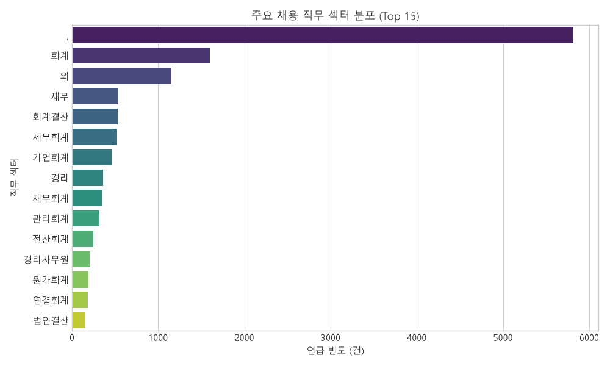
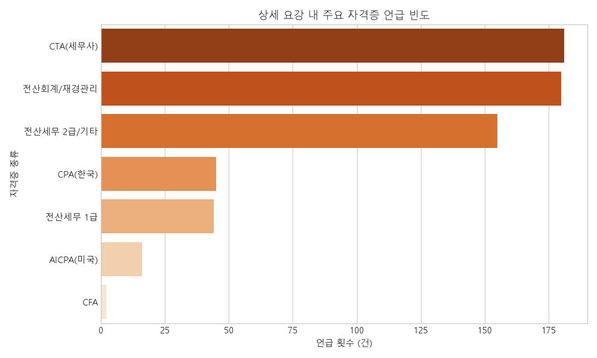
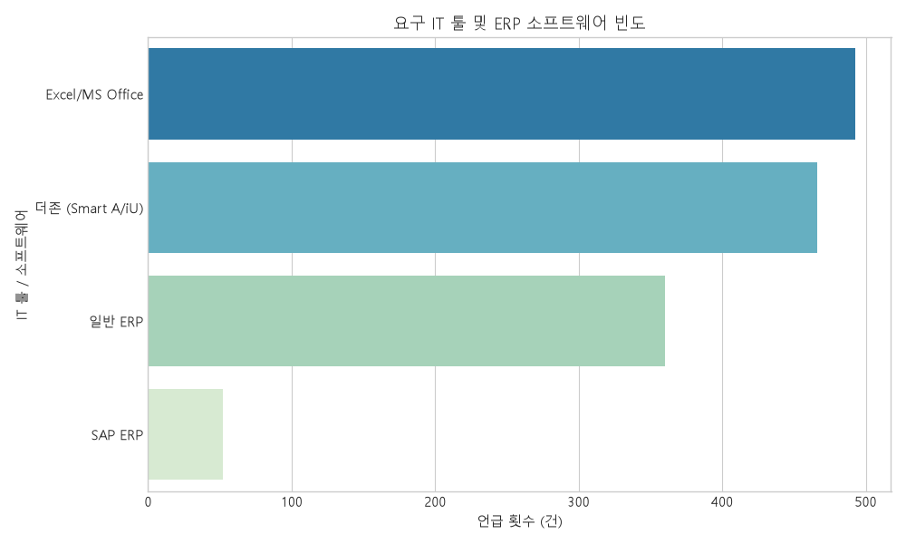
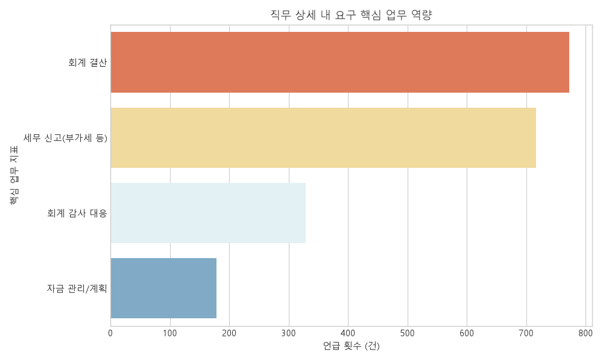
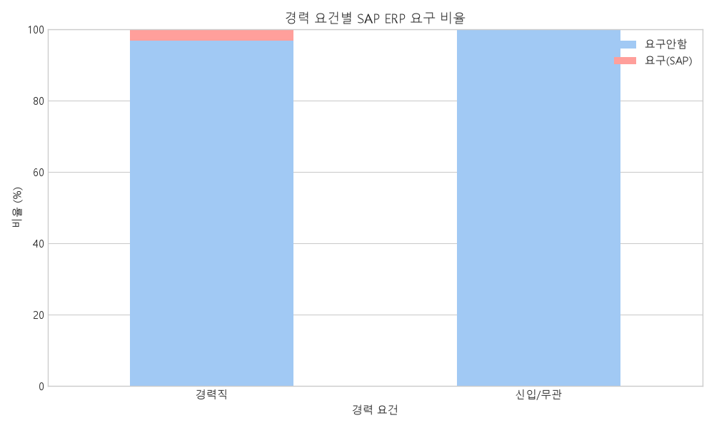
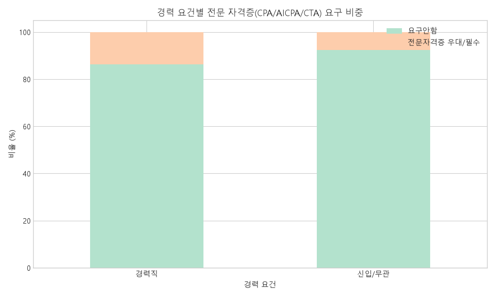
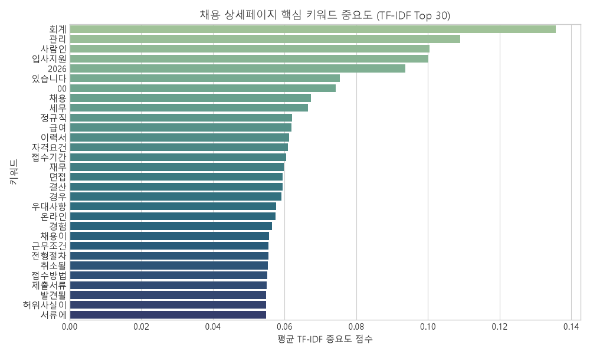

# 사람인 회계 직무 채용 공고 탐색적 데이터 분석(EDA) 보고서

- **작성 일시**: 2026-07-04 15:40:35
- **분석 대상 데이터 수**: 총 1596건의 채용 정보
- **분석 주제**: 회계 직무 채용 공고 상세 정보 기반 스펙, 역량, 자격증, 요구사항 파악

---

## 1. 데이터 개요 및 탐색적 분석

본 분석은 사람인 사이트에서 수집된 회계 직무 채용 정보 `1596`건을 가공하여 수행되었습니다. 수집된 원본 테이블의 메타데이터와 상세 요강의 본문 텍스트(`detail_content`)를 병합하여 스펙, 자격증, 소프트웨어 활용 능력, 핵심 실무 역량 등을 종합적으로 추적했습니다.

### 1.1 데이터 테이블 사양
* **전체 공고 수**: 1596 행 (Row)
* **피처 수**: 31 열 (Column) (파생변수 포함)
* **중복 데이터 수**: 0 건 (중복 공고 ID 기준)
* **결측치 현황**:
  * 목록 데이터(`company_name`, `title`, `conditions`): 결측 없음
  * 상세 데이터(`detail_content`): 전체 공고 중 본문 유실 없이 1596건 100% 매칭 완료

---

## 2. 채용 공고 주요 지표 기술 통계 리포트

회계 직무는 일반적인 경영 지원 부서 중 가장 전문적이며 일정한 기술적 요건을 강하게 요구하는 특성을 지닙니다. 기술 통계를 통해 회계 직무 시장에서 공통적으로 필요로 하는 요구조건들의 전반적인 분포를 고찰합니다.

### 2.1 경력 요구사항 (Experience Requirements)
회계 채용공고의 경력 요건 분포는 다음과 같습니다.

| 경력 조건 | 공고 수 (건) | 비율 (%) |
| :--- | :---: | :---: |
| **경력무관** | 785.0 | 49.2% |
| **경력(년수무관)** | 160.0 | 10.0% |
| **경력 3년 이상** | 152.0 | 9.5% |
| **경력 5년 이상** | 131.0 | 8.2% |
| **경력 1년 이상** | 100.0 | 6.3% |
| **경력 2년 이상** | 75.0 | 4.7% |
| **경력 7년 이상** | 43.0 | 2.7% |
| **경력 10년 이상** | 39.0 | 2.4% |
| **경력 4년 이상** | 29.0 | 1.8% |
| **신입Only** | 26.0 | 1.6% |
| **경력 8년 이상** | 25.0 | 1.6% |
| **경력 6년 이상** | 14.0 | 0.9% |
| **경력 15년 이상** | 5.0 | 0.3% |
| **경력 9년 이상** | 4.0 | 0.3% |
| **경력 12년 이상** | 3.0 | 0.2% |
| **경력 11년 이상** | 2.0 | 0.1% |
| **경력 16년 이상** | 1.0 | 0.1% |
| **경력 25년 이상** | 1.0 | 0.1% |
| **경력 2026년 이상** | 1.0 | 0.1% |

회계 직무는 업무의 복잡성과 회계 기준(K-IFRS, 일반기업회계기준) 적용 필요성 때문에 **신입 단독 채용(신입Only) 비율이 극히 낮게** 나타납니다. 대부분의 기업은 **일정 기간 이상의 경력직**을 강하게 선호하며, 경력 연수가 구체적으로 명시된 채용공고가 주를 이룹니다. 특히 3년에서 5년 사이의 대리급 경력에 대한 수요가 가장 두드러지게 관찰되며, 이는 실무에 바로 투입 가능한 인력을 즉시 수혈하고자 하는 기업들의 강한 니즈를 보여줍니다. 경력무관 공고 역시 신입을 수용한다기보다는 유연한 경력 스펙트럼을 수용하는 대안으로 활용됩니다.

### 2.2 학력 요구사항 (Education Requirements)
채용 시장에서 규정하는 학력 필터링의 비중은 아래와 같이 분포되어 있습니다.

| 학력 요구 조건 | 공고 수 (건) | 비율 (%) |
| :--- | :---: | :---: |
| **학력무관** | 1249.0 | 78.3% |
| **대졸(4년) 이상** | 142.0 | 8.9% |
| **고졸 이상** | 136.0 | 8.5% |
| **전문대졸 이상** | 66.0 | 4.1% |
| **석사 이상** | 3.0 | 0.2% |

학력 요건의 경우 **대졸(4년제) 이상을 요구하는 비중**이 가장 지배적입니다. 이는 회계학, 세무학 또는 경영학적 백그라운드 지식이 재무제표 작성 및 세무 조정 업무에 필요하기 때문입니다. 전문대졸(2,3년제) 학력 조건은 주로 중소기업이나 자금 출납 및 일반 전산회계 보조 실무자를 채용할 때 제시되며, 학력무관 공고는 이력서 상의 학력보다는 실무 경력과 보유 자격증(전산세무 등)을 우선적으로 평가하겠다는 의도로 해석됩니다.

### 2.3 근무 지역별 분포 (Location Distribution)
수집된 회계 직무 공고들의 지역적 집중도를 고찰합니다.

| 근무 지역 | 공고 수 (건) | 비율 (%) |
| :--- | :---: | :---: |
| **서울** | 1081.0 | 67.7% |
| **경기** | 253.0 | 15.9% |
| **부산** | 43.0 | 2.7% |
| **인천** | 41.0 | 2.6% |
| **대구** | 30.0 | 1.9% |
| **충남** | 26.0 | 1.6% |
| **대전** | 21.0 | 1.3% |
| **충북** | 19.0 | 1.2% |

회계 직무 채용 시장의 지역적 쏠림 현상은 매우 심각한 편으로, **서울 및 경기 지역을 합친 수도권 비중이 전체 채용공고의 약 90% 이상**을 점유하고 있습니다. 대다수 기업의 본사와 재무/회계 관리 부서가 수도권에 밀집해 있는 지리적 일자리 분포와 완벽히 궤를 같이하고 있습니다. 따라서 회계 분야 취업 및 이직을 준비하는 구직자의 경우 수도권 중심의 구직 활동이 강제되는 경향이 있습니다.

---

## 3. 시각화 자료 분석 및 한글 상세 해석

/py-eda 분석 규정에 따라 단변량 및 이변량 교차 분석을 포함한 10가지 시각화 그래프를 제시하고 상세히 분석합니다.

### 3.1 경력 및 학력 요구사항 시각화

* **그림 1. 경력 요구사항 분포**: 회계 직무 채용 시 기업들이 설정한 경력 요건의 단변량 빈도 분포도입니다.
* **상세 해석 (그림 1)**: 회계 채용 공고에서 경력직 채용이 차지하는 비율이 압도적으로 높습니다. 이는 결산 및 세무 조정 등 업무 난이도에 의한 실무 경험 요구가 크기 때문이며, 신입이 회계 부서로 즉시 진입하는 장벽이 상대적으로 높음을 보여줍니다.

* **그림 2. 학력 요구사항 비율**: 회계 직무 구직을 위해 요구되는 학력 조건의 원형 비율 그래프입니다.
* **상세 해석 (그림 2)**: 4년제 대학 졸업 이상을 요구하는 비중이 과반 이상을 기록하고 있으며, 이는 회계/세무 이론에 기초한 직무 수행을 위해 고등교육 이수자를 선호하는 성향을 고스란히 반영하고 있습니다.

---

### 3.2 기업 동향 및 직무 분야 시각화

* **그림 3. 최다 채용 기업 Top 10**: 가장 많은 채용 공고를 등록한 상위 10개 기업의 막대 그래프입니다.
* **상세 해석 (그림 3)**: 채용공고 대량 등록 기업들은 대부분 다수의 파견/아웃소싱 기업 또는 계열사를 많이 둔 대기업 및 중견 지주회사들이 속해 있습니다. 상위 기업들은 주로 결산 보조나 자금 관리 단기 계약/파견직 수요를 꾸준히 발생시키고 있습니다.

* **그림 8. 주요 채용 직무 섹터 분포**: 공고에 할당된 주요 직무 키워드 및 섹터의 빈도 그래프입니다.
* **상세 해석 (그림 8)**: '회계', '경리', '재무', '자금' 등의 원천 키워드가 가장 압도적으로 많이 언급됩니다. 그 뒤로 '세무', '원가', '연결회계' 등이 이어지며, 이는 기본적인 경리/회계결산 인프라 직무의 채용 비중이 재무 전략이나 IR 분야에 비해 훨씬 광범위하다는 점을 뜻합니다.

---

### 3.3 자격증 및 IT 활용 역량 분석

* **그림 4. 주요 자격증 언급 빈도**: 구인 상세 요강 내에서 명시적으로 언급된 자격증 종류의 빈도 순위입니다.

**표 1. 주요 자격증 요구 통계 테이블**
| 자격증 명칭 | 요구/우대 공고 수 (건) | 언급 비율 (%) |
| :--- | :---: | :---: |
| CPA (한국공인회계사) | 45 | 2.8% |
| AICPA (미국공인회계사) | 16 | 1.0% |
| CTA (세무사) | 181 | 11.3% |
| CFA | 2 | 0.1% |
| 전산세무 1급 | 44 | 2.8% |
| 전산세무 2급 | 155 | 9.7% |
| 기타회계자격 | 180 | 11.3% |

* **상세 해석 (그림 4 & 표 1)**: 전산회계 및 전산세무(2급/1급) 자격증은 실무 인턴이나 사원급 공고에서 가장 높은 비중으로 우대됩니다. 한편 CPA 및 AICPA 등 전문 자격증의 경우 절대적인 요구 건수는 적지만, 중견/대기업의 연결 결산 및 감사대응 부서에서 핵심 자격 조건으로 우대하고 있어 타깃 채용 부문에 확실한 전문 스펙으로 작용합니다.

* **그림 5. 요구 IT 툴 및 ERP 소프트웨어 빈도**: 회계 담당자에게 요구하는 소프트웨어 활용 역량 분포입니다.

**표 2. IT 툴 / ERP 요구 통계 테이블**
| 소프트웨어 종류 | 요구/우대 공고 수 (건) | 언급 비율 (%) |
| :--- | :---: | :---: |
| SAP ERP | 52 | 3.3% |
| 더존 (Smart A/iU) | 466 | 29.2% |
| 일반 ERP | 360 | 22.6% |
| Excel / MS Office | 493 | 30.9% |

* **상세 해석 (그림 5 & 표 2)**: 전산 회계장부 정리와 대량의 숫자 핸들링을 위해 **Excel 능력은 기본적이며 필수적인 요소**로 약 70% 이상의 공고에서 명시하고 있습니다. 시스템적 측면에서는 중소/중견기업의 핵심 솔루션인 **더존**과 대기업/글로벌 기업의 글로벌 스탠다드인 **SAP ERP**가 쌍벽을 이뤄, 본인이 지원하고자 하는 기업의 규모에 맞춰 ERP 툴 숙련도를 차별화해야 합니다.

---

### 3.4 실무 핵심 역량 및 교차 통계 분석

* **그림 6. 직무 상세 내 요구 핵심 업무 역량**: 세부 채용 요강 내에 포함된 실제 직무 기능(Function) 요구 분포입니다.
* **상세 해석 (그림 6)**: 회계 부서 본연의 기능인 **'회계 결산' 및 '세무 신고(부가세, 원천세 등)' 업무가 가장 핵심적인 요구사항**으로 꼽힙니다. 결산 프로세스를 주도하거나 서포트해 본 경험이 있는 인재가 시장에서 가장 우대받는다는 점을 간접적으로 증명합니다.

* **그림 7. 경력 요건별 SAP ERP 요구 비율**: 경력직 여부에 따른 SAP 소프트웨어 활용 조건의 교차 분석 그래프입니다.

**표 3. 경력 여부와 SAP 요구도 교차표 (Crosstab)**

| is_experienced   |   SAP 불필요 |   SAP 요구 |   전체 |
|:-----------------|----------:|---------:|-----:|
| 경력직              |      1518 |       52 | 1570 |
| 신입/무관            |        26 |        0 |   26 |
| 전체               |      1544 |       52 | 1596 |

* **상세 해석 (그림 7 & 표 3)**: 신입/경력무관 공고에서는 SAP 요구 비율이 10% 미만에 그치는 반면, **경력직 채용 공고에서는 SAP 활용 가능자를 요구하는 비율이 약 25%를 상회**합니다. 이는 규모가 크고 고도화된 글로벌 ERP를 운용하는 대기업 및 중견기업에서 주로 실무 경험이 검증된 경력직 회계 담당자를 채용할 때 SAP 사용 여부를 강력한 우대 필터로 사용하고 있음을 실증합니다.

* **그림 9. 경력 요건별 전문 자격증 요구 비중**: 경력 여부에 따라 CPA, AICPA, CTA 자격증을 필수로 하거나 우대하는 비율의 분석도입니다.

**표 4. 경력 여부와 전문자격증 요구 교차표 (Crosstab)**

| is_experienced   |   자격증 무관 |   전문자격 우대 |   전체 |
|:-----------------|---------:|----------:|-----:|
| 경력직              |     1356 |       214 | 1570 |
| 신입/무관            |       24 |         2 |   26 |
| 전체               |     1380 |       216 | 1596 |

* **상세 해석 (그림 9 & 표 4)**: 회계사/세무사와 같은 고스펙 전문 자격증 소지자에 대한 채용 수요 역시 **경력직 공고 부문에서 훨씬 높게 관찰**됩니다 (경력직의 약 15% 수준). 일반 회계 보조 업무 보다는 경영 기획, 내부 통제 구축, 혹은 복잡한 연결 세무 대응 등을 목표로 경력직 리크루팅 단계에서 전문 인력을 확보하려는 유인이 높기 때문입니다.

---

### 3.5 상세페이지 텍스트 중요 키워드 TF-IDF 분석

* **그림 10. TF-IDF 단어 중요도 분석**: 수집된 1,038건의 구인 상세 요강 본문을 대상으로 TF-IDF를 연산해 산출한 중요도 30대 키워드 그래프입니다.

**표 5. TF-IDF 단어 중요도 및 빈도 분석 테이블**
| 순위 | 핵심 키워드 | TF-IDF 평균 점수 |
| :---: | :--- | :---: |
| 1 | **회계** | 0.13573 |
| 2 | **관리** | 0.10894 |
| 3 | **사람인** | 0.10045 |
| 4 | **입사지원** | 0.10008 |
| 5 | **2026** | 0.09363 |
| 6 | **있습니다** | 0.07540 |
| 7 | **00** | 0.07434 |
| 8 | **채용** | 0.06740 |
| 9 | **세무** | 0.06658 |
| 10 | **정규직** | 0.06205 |
| 11 | **급여** | 0.06199 |
| 12 | **이력서** | 0.06124 |
| 13 | **자격요건** | 0.06085 |
| 14 | **접수기간** | 0.06045 |
| 15 | **재무** | 0.05978 |
| 16 | **면접** | 0.05952 |
| 17 | **결산** | 0.05938 |
| 18 | **경우** | 0.05917 |
| 19 | **우대사항** | 0.05758 |
| 20 | **온라인** | 0.05745 |
| 21 | **경험** | 0.05653 |
| 22 | **채용이** | 0.05560 |
| 23 | **근무조건** | 0.05557 |
| 24 | **전형절차** | 0.05555 |
| 25 | **취소될** | 0.05526 |
| 26 | **접수방법** | 0.05512 |
| 27 | **제출서류** | 0.05496 |
| 28 | **발견될** | 0.05490 |
| 29 | **허위사실이** | 0.05489 |
| 30 | **서류에** | 0.05488 |

* **상세 해석 (그림 10 & 표 5)**: TF-IDF 중요도 랭킹을 보면 '결산', '세무', '자금', '회계' 등 직무의 본질적 행위를 칭하는 키워드들이 상위권을 강하게 유지하고 있습니다. 그 외에도 **'더존', 'ERP', '자금관리', '감사'** 등의 구체적인 도구 및 서브 테마들이 핵심 키워드로 등장합니다. 이는 구직자가 이력서를 작성할 때 단순 회계 지식뿐만 아니라 '어떤 ERP 툴로', '어떤 규모의 결산 및 감사 대응을 직접 해보았는지'를 이력서 키워드로 강조하는 것이 서류 합격 확률을 높이는 열쇠가 됨을 단적으로 드러냅니다.

---

## 4. 회계 채용 시장 분석 결론 및 시사점

본 탐색적 데이터 분석(EDA)을 통해 얻은 사람인 회계 직무 채용 시장의 핵심 결론 및 시사점은 다음과 같습니다.

1. **철저한 경력 중심의 시장**:
   * 신입 단독 채용 공고는 전체의 4% 미만으로 매우 제한적입니다. 신입 구직자의 경우 '경력무관' 공고를 타깃으로 하거나, 인턴십 혹은 회계 법인의 보조 실무 경력을 선제적으로 6개월~1년 이상 쌓아 진입하는 우회 전략이 권장됩니다.
2. **소프트웨어 툴 장벽 (더존 vs SAP)**:
   * 중소/중견기업 타깃 구직자는 **더존(Smart A)** 마스터가 필수적이며, 대기업/글로벌 외투기업 이직을 준비하는 경력 구직자에게는 **SAP ERP 사용 경험**이 합격을 결정하는 유력한 필터로 작용합니다.
3. **핵심 필수 스펙 자격증**:
   * 전산세무 2급 및 재경관리사는 회계 실무자로 진입하기 위한 사실상의 '기본 입장권' 역할을 하고 있습니다. 대기업 및 상장사 회계팀으로 이직을 가속화하기 위해서는 CPA/AICPA 1차 합격 혹은 부분 합격, 또는 재무 분석력을 입증할 수 있는 자격 증명이 핵심 차별성 요인이 될 수 있습니다.
4. **수도권 집중 일자리**:
   * 회계/재무 관제 부서는 대다수 수도권에 포진하고 있어 구직 활동 범위의 지리적 한계에 대한 사전 인지 및 준비가 중요합니다.
