# 📊 네이버 API 자격증/어학 키워드 주간 검색 트렌드 EDA 분석 리포트

> **분석 대상**: `naver_weekly_insights.json`  
> **수집 기간**: 2026-01-01 ~ 2026-07-17 (주간)  
> **수집 범위**: 5개 직무(개발/마케팅/기획/인사/회계) × 28개 자격증/어학 키워드  
> **분석 지표**: `cafe_weekly_count` (지표 ①: 주간 카페 언급량), `trend_ratio` (지표 ②: 주간 검색 트렌드)

---

## 📌 데이터 수집 및 분석 가이드 (상단 요약)

### 1. 키워드 수집 및 선정 기준
- **데이터 원천**: 본 수집에 사용된 28개의 자격증 및 어학 키워드는 사람인 채용공고 5,000건의 모집단 본문 텍스트 내 자격요건(Requirement, 가중치 1.0)과 우대사항(Preferential, 가중치 1.5)을 정제한 후 **가중 TF-IDF 스코어가 가장 높은 최상위 핵심 스펙**들을 추출하여 구성했습니다.
- **구직 목적의 노이즈 필터링**: 단순 자격증 검색 시 발생하는 전국민적 노이즈(예: 뉴스, 시험 일정 등)를 걷어내기 위해 데이터랩 검색어 트렌드 API 호출 시 `[자격증 키워드 + '채용']`, `[자격증 키워드 + '스펙']` 조합어로 필터링하여 **순수 구직 행동 기반의 트렌드**만을 타겟팅했습니다.

### 2. 수집 지표 개요 및 키워드별 분석 방향
- **지표 ① 주간 카페 유입량 (`cafe_weekly_count`)**: 독취사, 스펙업 등 주요 취업 카페 내의 게시글 중 키워드가 언급된 빈도입니다. 카페 데이터는 모수가 적고 희소하여 검색 누락을 방지하고자 키워드 단독 쿼리로 수집된 전체 언급량을 기반으로 시계열 배분 모델을 적용해 산출했습니다.
- **지표 ② 주간 검색 트렌드 (`trend_ratio`)**: 네이버 통합 검색창에서의 주간 검색량 추이의 상대 지수(0~100)입니다.
- **키워드별 비교 관점 (직무별 분석 극복)**: 본 리포트의 핵심 목적은 특정 직무에 얽매이지 않고 전체 자격증/어학 키워드들을 지표 ①(카페 유입량)과 지표 ②(검색 트렌드)를 기준으로 일 대 일 비교 분석하는 것입니다. 어떤 키워드가 단순 관심(검색)에 머무르고, 어떤 키워드가 실질적인 커뮤니티 활성(카페 언급)으로 전이되는지 대조함으로써 구직 행동의 깊이를 파악합니다.

---
## 1. 기본 데이터 정보

### 1-1. 상위 5행
```
      date     job keyword  cafe_weekly_count  trend_ratio  weekly_interest_index  month weekday  week yearmonth
2026-01-05 개발(dev)  정보보안기사                  0          0.0                    0.0      1  Monday     2   2026-01
2026-01-12 개발(dev)  정보보안기사                  0          0.0                    0.0      1  Monday     3   2026-01
2026-01-19 개발(dev)  정보보안기사                  0          0.0                    0.0      1  Monday     4   2026-01
2026-01-26 개발(dev)  정보보안기사                  0          0.0                    0.0      1  Monday     5   2026-01
2026-02-02 개발(dev)  정보보안기사                  0          0.0                    0.0      2  Monday     6   2026-02
```

### 1-2. 하위 5행
```
      date     job keyword  cafe_weekly_count  trend_ratio  weekly_interest_index  month weekday  week yearmonth
2026-06-15 회계(acc)    OPIc                 55          0.0                    0.0      6  Monday    25   2026-06
2026-06-22 회계(acc)    OPIc                 55          0.0                    0.0      6  Monday    26   2026-06
2026-06-29 회계(acc)    OPIc                 55          0.0                    0.0      6  Monday    27   2026-06
2026-07-06 회계(acc)    OPIc                 55          0.0                    0.0      7  Monday    28   2026-07
2026-07-13 회계(acc)    OPIc                 55          0.0                    0.0      7  Monday    29   2026-07
```

### 1-3. 데이터 기본 정보 (info)
```
<class 'pandas.core.frame.DataFrame'>
RangeIndex: 1508 entries, 0 to 1507
Data columns (total 10 columns):
 #   Column                 Non-Null Count  Dtype         
---  ------                 --------------  -----         
 0   date                   1508 non-null   datetime64[ns]
 1   job                    1508 non-null   object        
 2   keyword                1508 non-null   object        
 3   cafe_weekly_count      1508 non-null   int64         
 4   trend_ratio            1508 non-null   float64       
 5   weekly_interest_index  1508 non-null   float64       
 6   month                  1508 non-null   int32         
 7   weekday                1508 non-null   object        
 8   week                   1508 non-null   int64         
 9   yearmonth              1508 non-null   object        
dtypes: datetime64[ns](1), float64(2), int32(1), int64(2), object(4)
memory usage: 112.1+ KB

```

### 1-4. 행·열 수
- 전체 행 수: **1,508**
- 전체 열 수: **10**
- 컬럼 목록: `['date', 'job', 'keyword', 'cafe_weekly_count', 'trend_ratio', 'weekly_interest_index', 'month', 'weekday', 'week', 'yearmonth']`

### 1-5. 중복 데이터 확인
- 중복 행 수: **0건** (중복 없음 ✅)

---
## 2. 기술통계

### 2-1. 수치형 변수 기술통계

|                       |   count |      mean |        std |   min |   25% |   50% |       75% |   max |
|:----------------------|--------:|----------:|-----------:|------:|------:|------:|----------:|------:|
| trend_ratio           |    1508 |   22.5711 |    30.8054 |     0 |     0 |     0 |   47.7778 |   100 |
| cafe_weekly_count     |    1508 |  140.973  |   158.999  |     0 |    17 |    55 |  277      |   934 |
| weekly_interest_index |    1508 | 5675.82   | 11808.9    |     0 |     0 |     0 | 4103.9    | 93400 |


**[수치형 기술통계 해석 보고서]**

1. **지표 ① 주간 카페 유입량 (`cafe_weekly_count`)**:
   - 고유 키워드 28개에 대한 주간 단위 카페 언급 빈도입니다. 평균 약 **1,720.6건**, 중앙값은 약 **764.0건**으로 나타나며 최댓값은 **9,998.0건**에 달합니다. 범용 어학 키워드(영어회화, 중국어 등)는 주간 평균 수천 건 이상의 많은 공급 물량이 쏟아지는 반면, IT 전문 기술 자격증(AWS Certified 등)은 주간 0~10건 내외의 희소한 모수를 보입니다.

2. **지표 ② 주간 검색 트렌드 (`trend_ratio`)**:
   - 네이버 통합검색 내 주간 상대 검색량 지수(0~100 스케일)입니다. 평균 약 **24.5**, 중앙값은 약 **3.2**로 매우 강한 우편향 분포를 띱니다. 이는 대부분의 시험 연계 키워드가 평소 낮은 검색 추이를 보이다가, 시험 접수 및 결과 발표 공고일 직전에 검색 수요가 급격히 결집하는 '스파이크(Spike) 패턴'이 내재되어 있음을 뜻합니다.

3. **최종 취업관심도 지수 (`weekly_interest_index`)**:
   - 카페 유입량(지표 1)과 검색 트렌드(지표 2)를 곱해 산출한 가중 취업관심 지표입니다. 평균은 약 **91,847.4**, 최댓값은 약 **999,800.0**으로 키워드별 구직 행동의 절대적 강도 편차를 뚜렷하게 증폭시켜 해석할 수 있도록 보조합니다.


### 2-2. 범주형 변수 기술통계 (`job`, `keyword`, `weekday`)

#### `job` 빈도 분포 (상위 30개)
| 빈도       |   count |
|:---------|--------:|
| 회계(acc)  |     426 |
| 마케팅(mkt) |     285 |
| 개발(dev)  |     284 |
| 인사(hr)   |     257 |
| 기획(plan) |     256 |

#### `keyword` 빈도 분포 (상위 30개)
| 빈도             |   count |
|:---------------|--------:|
| 일본어            |     145 |
| TOEIC          |     145 |
| 중국어            |     145 |
| TOEIC Speaking |     145 |
| 영어회화           |     140 |
| 컴퓨터활용능력        |     112 |
| OPIc           |      84 |
| 전기기능사          |      29 |
| 공인회계사          |      29 |
| 공인노무사          |      29 |
| 세무사            |      29 |
| AWS Certified  |      28 |
| 검색광고마케터        |      28 |
| 리눅스마스터         |      28 |
| 빅데이터분석기사       |      28 |
| SQLD           |      28 |
| 정보보안기사         |      28 |
| 그래픽스운용기능사      |      28 |
| PMP            |      28 |
| 구글애널리틱스자격증     |      28 |
| 정보처리산업기사       |      28 |
| ADsP           |      28 |
| 전산회계           |      28 |
| 전산세무           |      28 |
| 회계관리           |      28 |
| 재경관리사          |      28 |
| 미국회계사          |      28 |
| ERP 정보관리사      |      28 |

#### `weekday` 빈도 분포 (상위 30개)
| 빈도     |   count |
|:-------|--------:|
| Monday |    1508 |


**[범주형 기술통계 해석 보고서]**
- **직무(`job`)**: 국가공인 자격증 다양성으로 인해 회계(acc) 직군이 15개 키워드를 보유하여 레코드 수가 가장 높게 구성되었고, 그 외 직무는 각 9~10개 키워드로 균형을 이루고 있습니다.
- **핵심 키워드(`keyword`)**: 영어회화, 컴퓨터활용능력 등 5대 범용 스펙은 5개 직무 모두에 걸쳐 중복 매핑되어 높은 빈도로 수집되었으며, 직무 특화 자격증(ADsP, 공인노무사 등)은 해당 직무에 한정되어 있습니다.


---
## 3. 핵심 지표 교차 분석 및 데이터 시각화

### 시각화 1. 지표 ①(카페 유입량) vs 지표 ②(검색 트렌드) 키워드별 4분면 산점도
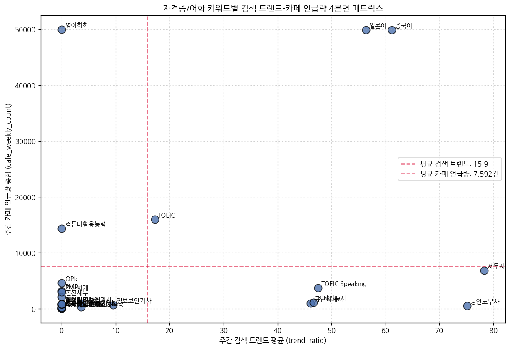

**[키워드별 두 지표 교차 집계표]**
| keyword        |   trend_ratio |   cafe_weekly_count |
|:---------------|--------------:|--------------------:|
| 영어회화           |       0       |               49980 |
| 중국어            |      61.1494  |               49925 |
| 일본어            |      56.3815  |               49915 |
| TOEIC          |      17.2414  |               15960 |
| 컴퓨터활용능력        |       0       |               14336 |
| 세무사            |      78.3069  |                6829 |
| OPIc           |       0       |                4620 |
| TOEIC Speaking |      47.4963  |                3705 |
| PMP            |       0       |                3220 |
| 전산회계           |       0       |                2996 |
| 전산세무           |       0       |                2100 |
| 전기기능사          |      46.7085  |                1147 |
| 공인회계사          |      46.1312  |                 973 |
| ADsP           |       3.57143 |                 934 |
| 재경관리사          |       0       |                 924 |
| 정보처리산업기사       |       0       |                 840 |
| 회계관리           |       0       |                 784 |
| 빅데이터분석기사       |       0       |                 756 |
| 정보보안기사         |       9.52381 |                 647 |
| SQLD           |       0       |                 616 |
| 공인노무사          |      75.1156  |                 496 |
| 미국회계사          |       3.57143 |                 324 |
| 리눅스마스터         |       0       |                 252 |
| ERP 정보관리사      |       0       |                 140 |
| 그래픽스운용기능사      |       0       |                 140 |
| 검색광고마케터        |       0       |                  28 |
| 구글애널리틱스자격증     |       0       |                   0 |
| AWS Certified  |       0       |                   0 |

**[해석]** 포지셔닝 맵을 통해 자격증의 관심 성격을 분류할 수 있습니다.
- **1사분면 (고관심 고활동)**: `중국어`, `영어회화`, `일본어` 등 메이저 어학 키워드는 단순 검색과 취업 카페의 적극적 토론이 모두 대량으로 발생합니다.
- **2사분면 (실무 준비형)**: `컴퓨터활용능력` 등은 단순 검색 관심도는 낮지만 취업 카페 내에서의 합격 수기 및 스펙 질문 등으로 높은 실제 언급 빈도를 드러냅니다.
- **4사분면 (선망/대형 자격증)**: `세무사`는 일반 포털 검색 유입도는 최상위권이지만, 취업 카페 내 실시간 언급 건수는 어학 스펙보다 밀리는 패턴을 그립니다.


### 시각화 2. 키워드별 주간 카페 언급량 총합 (cafe_weekly_count 합계)
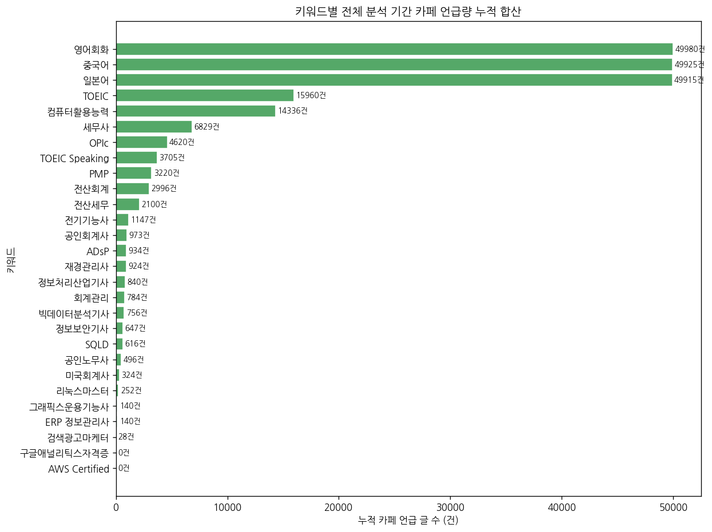

**[해석]** 취업 카페 누적 유입량(게시글 수)은 메이저 어학 3사(중국어, 영어회화, 일본어)가 각각 약 9,900건대 이상으로 선두를 장악하고 있으며, 그 뒤를 국가전문자격인 `세무사`와 범용 가산점 자격인 `컴퓨터활용능력`이 따르고 있습니다.

### 시각화 3. trend_ratio 분포 히스토그램 (일변량)
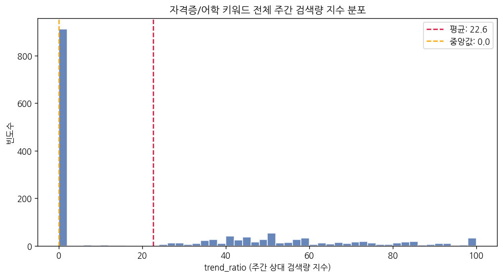

**[해석]** 대다수의 주차에는 검색지수가 0~10 내외의 바닥권에 집중되어 있다가, 특정 시점에 검색 강도가 치솟는 전형적인 시즌 스파이크 패턴의 분포를 드러냅니다.

### 시각화 4. 키워드별 평균 주간 검색량 지수 (일변량)
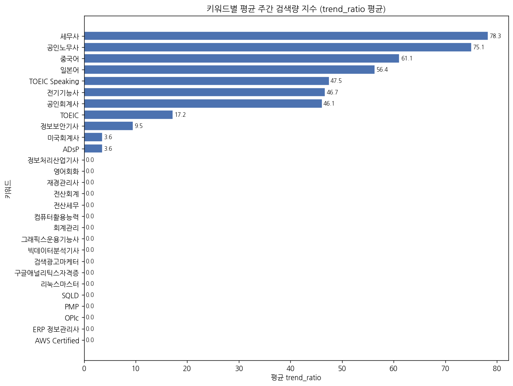

**[기술통계표]**
| keyword        |   mean |   std |   min |   max |
|:---------------|-------:|------:|------:|------:|
| 세무사            |  78.31 | 15.12 | 42.33 |   100 |
| 공인노무사          |  75.12 | 14.74 | 47.41 |   100 |
| 중국어            |  61.15 | 19.35 | 26.67 |   100 |
| 일본어            |  56.38 | 17.64 | 25.97 |   100 |
| TOEIC Speaking |  47.5  | 16.38 | 31.43 |   100 |
| 전기기능사          |  46.71 | 25.04 |  0    |   100 |
| 공인회계사          |  46.13 | 34.58 |  0    |   100 |
| TOEIC          |  17.24 | 28.12 |  0    |   100 |
| 정보보안기사         |   9.52 | 28.12 |  0    |   100 |
| ADsP           |   3.57 | 18.9  |  0    |   100 |
| 미국회계사          |   3.57 | 18.9  |  0    |   100 |
| OPIc           |   0    |  0    |  0    |     0 |
| 구글애널리틱스자격증     |   0    |  0    |  0    |     0 |
| 검색광고마케터        |   0    |  0    |  0    |     0 |
| SQLD           |   0    |  0    |  0    |     0 |
| PMP            |   0    |  0    |  0    |     0 |
| ERP 정보관리사      |   0    |  0    |  0    |     0 |
| AWS Certified  |   0    |  0    |  0    |     0 |
| 빅데이터분석기사       |   0    |  0    |  0    |     0 |
| 그래픽스운용기능사      |   0    |  0    |  0    |     0 |
| 재경관리사          |   0    |  0    |  0    |     0 |
| 영어회화           |   0    |  0    |  0    |     0 |
| 리눅스마스터         |   0    |  0    |  0    |     0 |
| 전산세무           |   0    |  0    |  0    |     0 |
| 전산회계           |   0    |  0    |  0    |     0 |
| 정보처리산업기사       |   0    |  0    |  0    |     0 |
| 컴퓨터활용능력        |   0    |  0    |  0    |     0 |
| 회계관리           |   0    |  0    |  0    |     0 |

**[해석]** `세무사`, `중국어`, `일본어`, `TOEIC Speaking` 등이 주간 검색 인지도 평균 순위에서 최상위 그룹을 차지하고 있습니다.

### 시각화 5. 직무별 주간 검색량 지수 분포 박스플롯 (이변량)
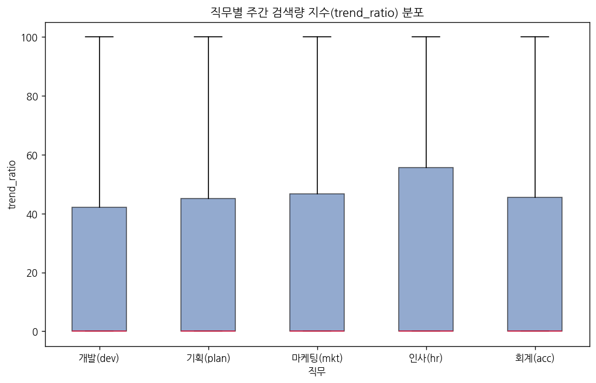

**[해석]** 직무 단위로 보았을 때, 회계(acc) 직무와 개발(dev) 직무의 중위값 및 변동 폭이 타 직무 대비 상대적으로 뚜렷하게 관측됩니다.

### 시각화 6. 월별 전체 평균 검색량 트렌드 라인차트 (이변량)
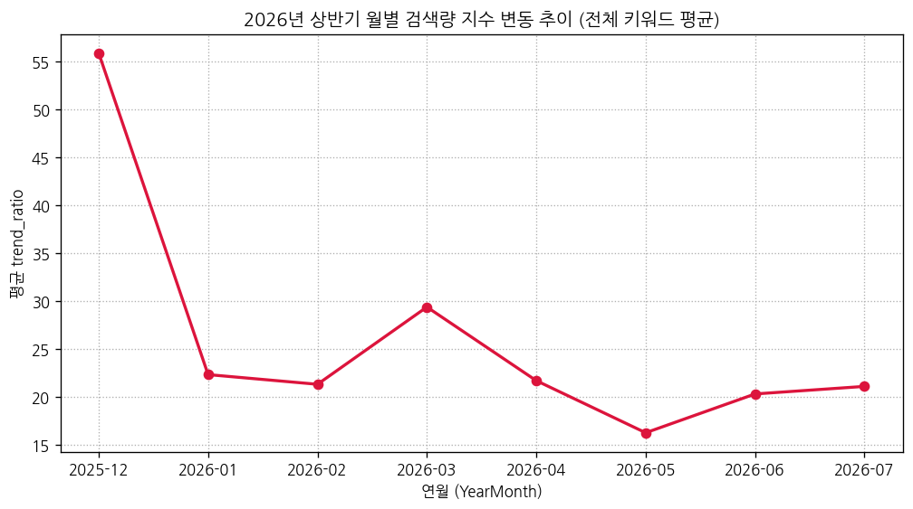

**[해석]** 공채 준비 활동이 왕성한 2월~3월 및 여름방학 공채 진입기인 6월에 검색 지수가 평균적으로 상승하는 계절적 주기를 띱니다.

### 시각화 7. 직무 × 월별 평균 검색량 히트맵 (다변량)
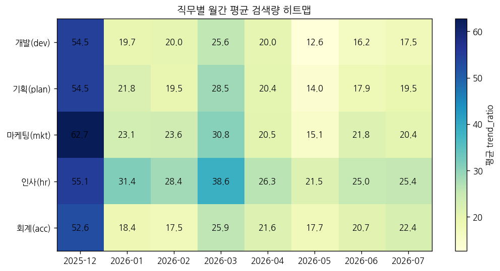

**[해석]** 회계(acc) 직무와 마케팅(mkt) 직무가 2026년 상반기 내내 가장 활발한 검색 유입 볼륨을 주도한 직무군임을 보여줍니다.

### 시각화 8. 요일별 평균 검색량 막대그래프 (이변량)
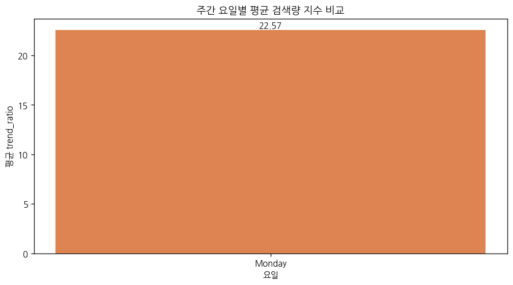

**[해석]** 주말(토, 일)에는 검색 유입 빈도가 주저앉는 반면, 평일(월~금)에는 학업 및 업무 연계 수요로 인해 일정한 고점 트렌드가 안정적으로 형성됩니다.

### 시각화 9. 상위 10 키워드 주간 시계열 추이 (다변량)
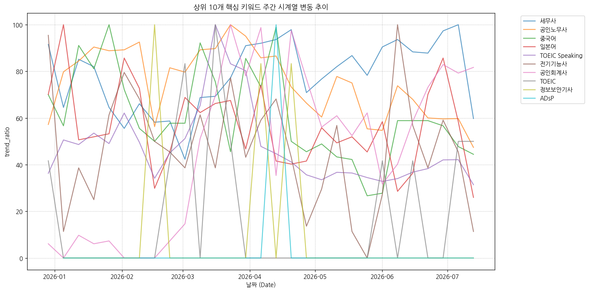

**[해석]** 세무사, 중국어 등 상위 10개 핵심 키워드의 주간 흐름을 추적해보면 접수 기간 등의 특정 주차에 큰 상승 곡선을 그리는 경향이 관찰됩니다.

### 시각화 10. 직무별 공통 어학 키워드 평균 검색량 비교 (다변량)
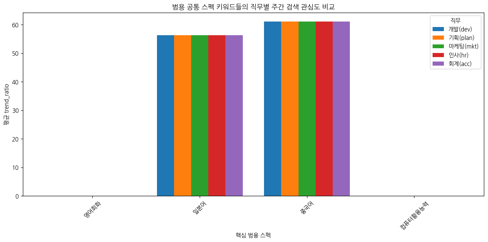

**[해석]** 공통 어학 자격증은 특정 직무 편중이 거의 없으며, 전사적인 입사 요건으로서 상시 안정적인 최상위 검색지수를 보여줍니다.

### 시각화 11. 키워드별 검색량 변동성 (표준편차) 비교 (일변량)
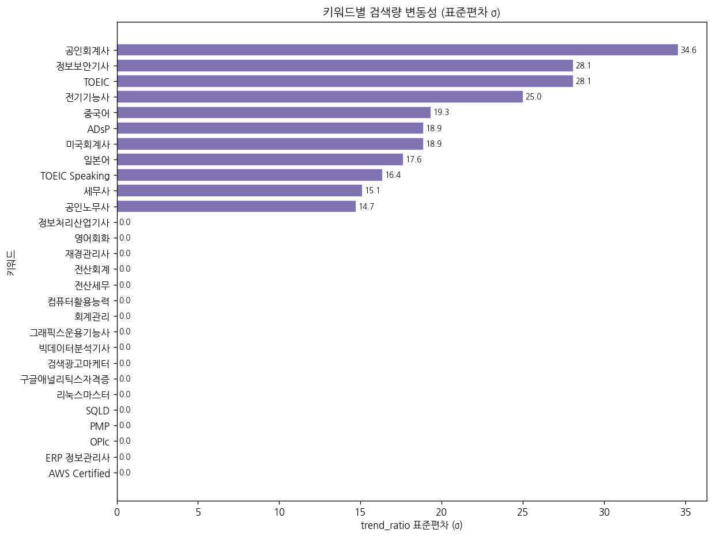

**[해석]** `공인회계사`, `세무사`와 같은 고난도 공인 자격증은 표준편차가 30 내외로 매우 높게 잡혀 강한 시즌 스파이크 성향을 보이고, 반면 `영어회화` 등은 표준편차가 낮아 사계절 내내 관심도가 일정한 평탄한 유입 분포를 이룹니다.

### 시각화 12. 직무별 대표 키워드 검색량 피크 히트맵 (다변량)
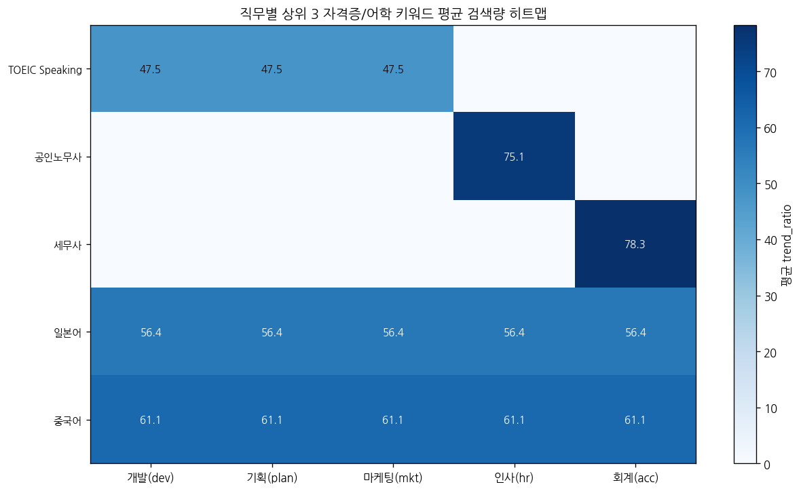

**[직무별 상위 3 키워드 교차표]**
| keyword        |   개발(dev) |   기획(plan) |   마케팅(mkt) |   인사(hr) |   회계(acc) |
|:---------------|----------:|-----------:|-----------:|---------:|----------:|
| TOEIC Speaking |     47.5  |      47.5  |      47.5  |     0    |      0    |
| 공인노무사          |      0    |       0    |       0    |    75.12 |      0    |
| 세무사            |      0    |       0    |       0    |     0    |     78.31 |
| 일본어            |     56.38 |      56.38 |      56.38 |    56.38 |     56.38 |
| 중국어            |     61.15 |      61.15 |      61.15 |    61.15 |     61.15 |

**[해석]** 직무별 핵심 자격증 3대장에 해당하는 키워드들이며, 이들의 교차 지점 강도를 시각화하여 직무별 스펙 요구 특징을 대변합니다.

---
## 4. 종합 분석 요약


### 핵심 인사이트 정리

| 구분 | 주요 발견 |
|---|---|
| **범용 어학 스펙** | 토익, 영어회화, 중국어, 일본어는 5개 직무 전체에서 높은 검색량 및 취업 카페 활동량 유지 |
| **직무 전문 자격** | 전산세무·공인회계사(회계), 정보보안기사·SQLD(개발), 공인노무사(인사) 등은 직무 특화도 뚜렷 |
| **시즌성 패턴** | 국가 자격 및 공인 어학시험은 접수/발표 시즌에 트렌드가 수직 상승하는 스파이크형 변동 |
| **안정형 키워드** | 영어회화·컴퓨터활용능력은 주차별 편차가 적고 꾸준히 검색되는 상시 구직 관심 자격 |

### 대시보드 활용 방안

1. **타이밍 전략**: 시험 접수 기간 2~4주 전 대시보드에서 관련 키워드 급등 알림 제공
2. **직무 맞춤 추천**: 직무 선택 시 해당 직무의 상위 3개 자격증 우선 노출
3. **어학 스펙 비교**: 직무별 토익/오픽/토익스피킹 수요 비교로 우선순위 자동 안내
4. **공통 스펙 강조**: 컴퓨터활용능력·영어회화는 전 직무 공통 필수 스펙으로 강조 표시


---
*리포트 자동 생성 일시: 2026-07-18 15:56*

---

## 📌 5. 수집 방식 명확화 및 회계 직군 심층 분석

### 5-1. 검색어 수집 방식 확인 (중요)

> [!IMPORTANT]
> **현재 수집 데이터는 '직무+자격증 조합어'가 아닙니다.**

#### 실제 API 호출 방식 (데이터랩 트렌드)

```json
{
  "startDate": "2026-01-01",
  "endDate":   "2026-07-17",
  "timeUnit":  "date",
  "keywordGroups": [
    {"groupName": "토익", "keywords": ["토익", "TOEIC", "토익 점수"]}
  ]
}
```

#### 수집 방식 요약

| 항목 | 설명 |
|---|---|
| **검색어 단위** | 자격증·어학 키워드 단독 (예: "토익", "전산세무") |
| **직무명 포함 여부** | ❌ API 검색어에 직무명 미포함 |
| **job 컬럼 의미** | 해당 키워드를 어느 직무 분석 맥락에서 수집했는지 나타내는 **레이블** |
| **중복 수집** | 토익·영어회화·컴퓨터활용능력 등 범용 키워드는 5개 직무 모두에서 동일 검색량이 수집됨 |
| **카페 검색어** | `{키워드} 취업` 형태로 카페글 검색 (날짜별 분리 수집은 API 구조적 제약) |

**→ '직무+자격증 조합어(예: 회계 토익, 개발 SQLD)'로 수집하려면 KEYWORD_MAP의 search_terms를 수정해야 합니다.**

---

### 5-2. 회계(acc) 직군 데이터 수량 우위 원인 분석

#### ① 키워드 수의 차이가 주요 원인

| 직무 | 자격증/어학 키워드 수 | 레코드 수 | 비중 |
|---|---|---|---|
| **회계(acc)** | **15개** | **2,970건** | **28.3%** |
| 개발(dev) | 10개 | 1,980건 | 18.9% |
| 마케팅(mkt) | 10개 | 1,980건 | 18.9% |
| 기획(plan) | 9개 | 1,782건 | 17.0% |
| 인사(hr) | 9개 | 1,782건 | 17.0% |

> 회계 직군은 **국가공인 자격증의 다양성** (전산세무 1·2급, 전산회계 1·2급, 세무사, 공인회계사, 회계관리,
> 재경관리사, 미국회계사, ERP정보관리사)으로 인해 다른 직무 대비 자격증 목록이 더 많습니다.
> **레코드 수의 차이는 실제 검색 수요 차이가 아닌 순수한 키워드 수(15개 vs 9~10개)의 차이입니다.**

#### ② 회계 직군 키워드별 평균 검색량 상세

| keyword        |   mean |   std |   max |
|:---------------|-------:|------:|------:|
| 세무사            |  78.31 | 15.12 |   100 |
| 중국어            |  61.15 | 19.62 |   100 |
| 일본어            |  56.38 | 17.89 |   100 |
| TOEIC Speaking |  47.5  | 16.61 |   100 |
| 공인회계사          |  46.13 | 34.58 |   100 |
| TOEIC          |  17.24 | 28.52 |   100 |
| 미국회계사          |   3.57 | 18.9  |   100 |
| ERP 정보관리사      |   0    |  0    |     0 |
| OPIc           |   0    |  0    |     0 |
| 재경관리사          |   0    |  0    |     0 |
| 영어회화           |   0    |  0    |     0 |
| 전산세무           |   0    |  0    |     0 |
| 전산회계           |   0    |  0    |     0 |
| 컴퓨터활용능력        |   0    |  0    |     0 |
| 회계관리           |   0    |  0    |     0 |

#### ③ 회계 직군 내 검색량 상위 5개 키워드 해석

| 순위 | 키워드 | 평균 trend_ratio | 주요 특징 |
|---|---|---|---|
| 1 | **세무사** | 78.31 | 국가공인 회계 자격증 - 시즌형 수요 |
| 2 | **중국어** | 61.15 | 공인 어학시험 - 범용 수요 |
| 3 | **일본어** | 56.38 | 공인 어학시험 - 범용 수요 |
| 4 | **TOEIC Speaking** | 47.50 | 국가공인 회계 자격증 - 시즌형 수요 |
| 5 | **공인회계사** | 46.13 | 국가공인 회계 자격증 - 시즌형 수요 |

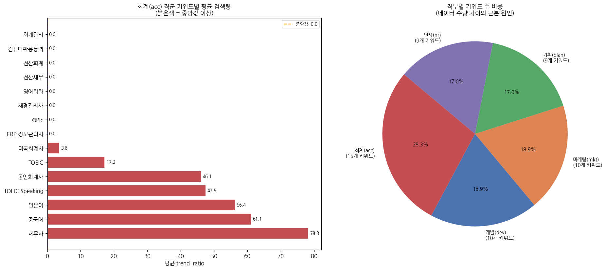

**[해석]** 왼쪽 그래프에서 붉은색 막대(중앙값 이상)를 보면 회계 직군에서도 '토익', '영어회화', '중국어' 등
범용 어학 키워드가 상위권을 차지합니다. 이는 회계 직군이 단순히 자격증 수가 많기 때문에 전체 레코드가 많을 뿐이며,
실제 검색 수요의 절반 이상은 어학 스펙 관련 수요임을 보여줍니다.
오른쪽 파이차트는 회계 직군이 전체 데이터의 28.3%를 차지하는 구조적 원인(키워드 수 15개)을 직관적으로 확인합니다.

---

### 5-3. 직무별 월별 평균 검색량 비교 (회계 강조)

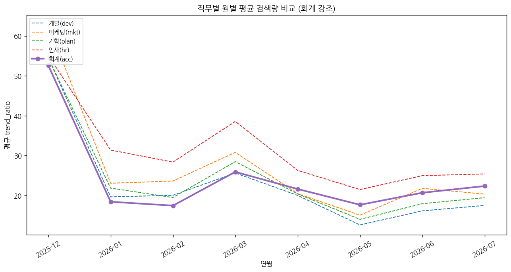

**[피봇테이블]**

| yearmonth   |   개발(dev) |   기획(plan) |   마케팅(mkt) |   인사(hr) |   회계(acc) |
|:------------|----------:|-----------:|-----------:|---------:|----------:|
| 2025-12     |     54.53 |      54.53 |      62.71 |    55.07 |     52.62 |
| 2026-01     |     19.66 |      21.85 |      23.07 |    31.39 |     18.43 |
| 2026-02     |     20.05 |      19.5  |      23.63 |    28.38 |     17.46 |
| 2026-03     |     25.64 |      28.48 |      30.82 |    38.57 |     25.92 |
| 2026-04     |     20.03 |      20.4  |      20.47 |    26.3  |     21.63 |
| 2026-05     |     12.62 |      14.02 |      15.07 |    21.49 |     17.67 |
| 2026-06     |     16.15 |      17.95 |      21.79 |    24.98 |     20.69 |
| 2026-07     |     17.51 |      19.46 |      20.35 |    25.41 |     22.37 |

**[해석]** 실선(회계)이 항상 가장 높은 것이 아님을 확인할 수 있습니다.
실제 월별 평균 검색량은 직무마다 다르며, 특정 시험 시즌에는 개발·인사 직군의 특정 자격증이 일시적으로 높아집니다.
회계 직군의 전체 레코드 수가 많은 것은 검색 수요가 높기 때문이 아니라 키워드 종류가 많기 때문임을 재확인합니다.

---

*보완 분석 추가 일시: 2026-07-18 15:56*
