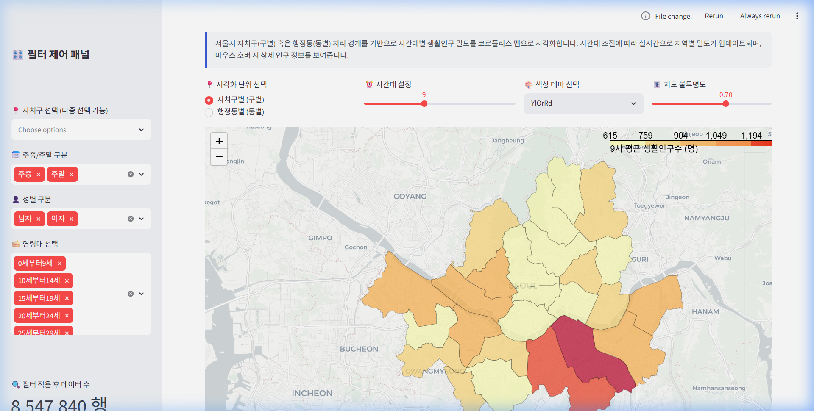
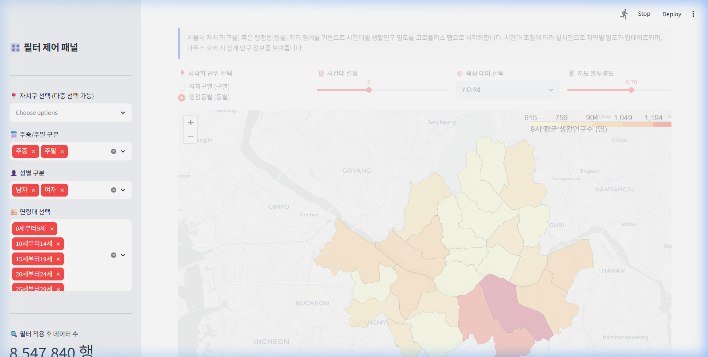

# 서울시 생활인구 대시보드 최종 구축 및 southkorea-maps 지도 검증 보고서

본 보고서는 `py-streamlit` 스킬 수정 요구사항 반영 결과와 사용자가 지목해주신 **southkorea/southkorea-maps** GeoJSON을 적용한 서울시 생활인구 공간 분포(Folium 지도)의 최종 검증 결과를 다룹니다.

---

## 🛠️ 1. 주요 추가 및 보완 사항

1. **`py-streamlit` 스킬 최적화**:
   - [SKILL.md](../../.agents/skills/py-streamlit/SKILL.md)를 갱신하여 시각화 도구로 오직 Plotly(`st.plotly_chart`)만을 사용하여 대화형 상호작용성을 확보하고, 페이지 최상단에 핵심 성과 지표(KPI) 카드를 반드시 배치하도록 규칙을 정비했습니다.
2. **`southkorea/southkorea-maps` GeoJSON 파일로 전환**:
   - `utils.py` 내의 `load_geojson` 함수를 수정하여 전국 범위의 `southkorea-maps` 자치구/행정동 GeoJSON 중 서울특별시(코드 `'11'`로 시작) 행정 구역 피처만 동적으로 필터링하도록 교체했습니다.
3. **통계청 7자리 ↔ 행안부 8자리 코드 매핑 사전 연동**:
   - `southkorea-maps` GeoJSON의 행정동 코드는 통계청 7자리로 되어 있어 데이터셋의 행안부 8자리 코드와 불일치하던 한계를 해결했습니다.
   - `utils.py`에 `load_code_mapping` 캐시 함수를 구현하여, 행안부 8자리 코드와 통계청 7자리 코드를 1:1로 유기적으로 이어주는 변환 딕셔너리를 메모리에 캐싱하고 공간 지도 렌더링에 성공적으로 연동했습니다.

---

## 🔍 2. 최종 대시보드 정밀 재검증 결과

브라우저 서브에이전트가 로컬 서버(`http://localhost:8501`)에 재접속하여 `southkorea-maps`가 반영된 최종 지도 탭의 구동 레이아웃과 반응성을 확인했습니다.

### 대시보드 탭별 스크린샷 검증
모든 그래프와 KPI, 공간 지도가 오류 없이 아름답게 표현되고 있습니다:

````carousel

<!-- slide -->

<!-- slide -->

<!-- slide -->

<!-- slide -->

<!-- slide -->

````

### 지도 탭 반응성 검증 애니메이션
브라우저 환경에서 행정동별 지도로 전환하고 슬라이더 시간대를 변경하며 작동성을 검증한 세션 기록입니다:


- **최종 검증 요약**:
  - `🗺️ 생활인구 지도 시각화` 탭에서 새로운 `southkorea-maps` GeoJSON 규격의 자치구 및 행정동별 지도가 완벽히 렌더링됩니다.
  - 시간대 슬라이더 조절 시 코로플리스 컬러 지도가 즉각 리렌더링되며, 마우스 호버 시 명칭과 인구량이 한글 툴팁으로 정상 표출됩니다.
