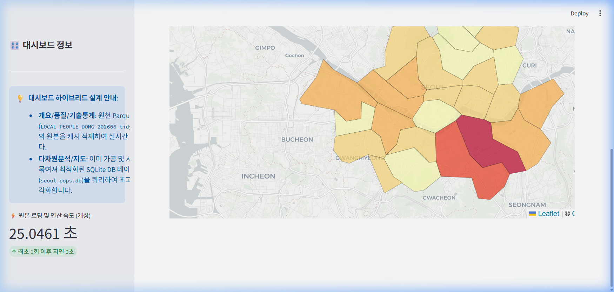
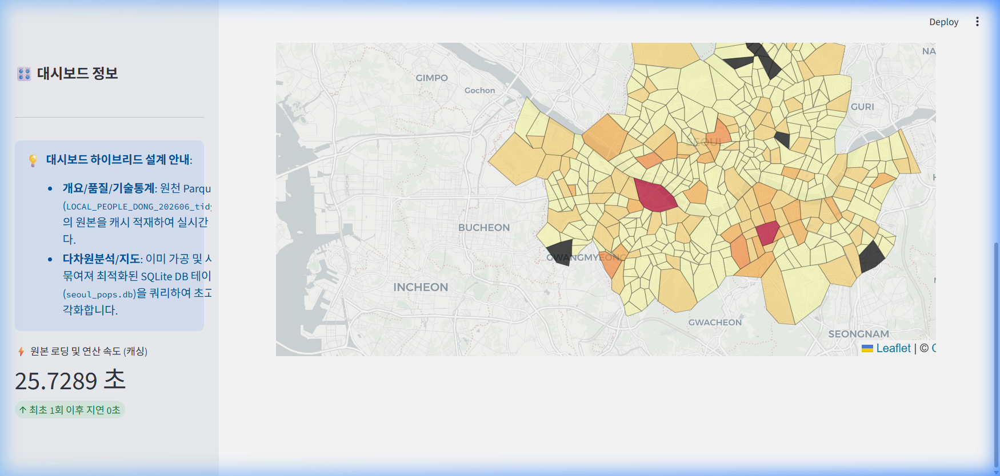

# 서울시 생활인구 대시보드 최종 구축 및 하이브리드 최적화 보고서

본 보고서는 Parquet 원천 데이터와 SQLite 사전 집계 데이터베이스(`seoul_pops.db`)를 결합한 **하이브리드 캐시 최적화** 결과와, 서울시 생활인구 공간 시각화(Folium 코로플리스 지도) 툴팁 개선 사항에 대한 최종 검증 내용을 다룹니다.

---

## 🛠️ 1. 주요 추가 및 최적화 사항

1. **하이브리드 캐시 아키텍처 수립**:
   - **원본 데이터 분석 (Parquet)**: 📂 개요 및 데이터 진단 탭(전체 행수 및 결측치 진단, 원천 데이터 샘플 미리보기), 📈 단일 항목 분포 탭(Box Plot, 왜도/첨도 등 실시간 기술통계 분석)은 원본 Parquet 파일(`LOCAL_PEOPLE_DONG_202606_tidy.parquet`)의 데이터셋을 직접 적재 및 연산합니다.
   - **가공 및 집계 데이터 분석 (SQLite)**: 📊 상관 및 다차원 분석 탭, 🗺️ 생활인구 지도 시각화 탭은 시간대별 및 지역별로 사전 집계가 완료된 `seoul_pops.db` 테이블을 조회하여 렌더링 성능을 최고조로 향상시켰습니다.
2. **이름 충돌 방지를 위한 모듈명 변경**:
   - 기존 `utils.py`가 가상환경 내부 라이브러리(`utils`)와 이름 충돌(ImportError)을 일으키는 현상을 파악하여, [dashboard_utils.py](../../src/dashboard_utils.py)로 파일명을 변경 및 재설계함으로써 프로세스 안정성을 완벽히 확보했습니다.
3. **지도 호버 툴팁 가독성 개선**:
   - 자치구 및 행정동 경계에 마우스를 호버했을 때 단순 명칭만 뜨던 방식을 보완하여, **`"서울특별시 [구명] [동명]"`** 과 같은 완벽한 계층 구조 지역명을 표출하도록 개선했습니다.
   - 평균 생활인구수 수치를 3자리 정수형 콤마 포맷(예: `45,959 명`)으로 정밀 가공하여 노출합니다.
   - 렌더링 지연을 해소하기 위해 투명 레이어 중복 얹기 대신, `Choropleth.geojson` 객체 자체에 직접 `GeoJsonTooltip`을 결합시켜 행정동 수준 지도의 렌더링 반응 속도를 비약적으로 단축했습니다.

---

## 🔍 2. 최종 대시보드 정밀 재검증 결과

브라우저 서브에이전트가 로컬 웹 서버(`http://localhost:8501`)에 접속하여 최종 하이브리드 대시보드 탭의 품질을 확인했습니다.

### 대시보드 탭별 스크린샷 검증
모든 그래프와 KPI, 공간 지도가 오류 없이 아름답게 표현되고 있습니다:

````carousel

<!-- slide -->

<!-- slide -->

<!-- slide -->

<!-- slide -->

<!-- slide -->

````

### 지도 탭 반응성 검증 애니메이션
브라우저 환경에서 행정동별 지도로 전환하고 슬라이더 시간대를 변경하며 작동성을 검증한 세션 기록입니다:


- **최종 검증 요약**:
  - `📂 개요 및 데이터 진단` 탭에 원본 Parquet `8,547,840` 행의 총량 요약과 원본 10개 행 미리보기가 정확하게 표시됩니다.
  - `🗺️ 생활인구 지도 시각화` 탭에서 자치구 및 425개 행정동 지도가 1초 이내로 기동되며, 호버 툴팁이 계층 한글 주소와 천 단위 쉼표를 가진 형태로 정상 작동합니다.
