# 쇼핑몰 리뷰 데이터 TF-IDF 군집화, 실루엣 분석, 상위/하위 50개 키워드 및 교차표 심층 리포트

본 보고서는 `shop-review/data/shop-review.csv` 데이터를 활용하여 리뷰 데이터의 제목(`title`)과 내용(`content`), 그리고 상품명(`product`)의 반영 여부에 따른 K-Means(k=4) 군집화 결과, **군집별 상위 30개 및 하위 50개 키워드(Bottom 50 Keywords) 분석**, 그리고 **지도학습 랜덤 포레스트 피처 중요도 분석**까지 종합 정돈한 심층 분석 보고서입니다.

---

# PART 1: 기존 리뷰 텍스트 기준 군집 분석 (PRODUCT 미포함)

PART 1은 리뷰 데이터의 `title`과 `content` 컬럼을 공백으로 합친 텍스트를 대상으로 TF-IDF 벡터화 및 K-Means(k=4) 군집화를 수행한 결과입니다.

## 1. 데이터 개요 및 탐색적 기초 통계

| 항목 | 내용 |
| :--- | :--- |
| **전체 데이터 수** | 8,042 행 (Rows) |
| **전체 컬럼 수** | 4 개 (`title`, `content`, `product`, `mallName`) |
| **중복 데이터** | 4 행 (0.05%) |
| **분석 대상 텍스트** | HTML 태그 정제 후 `title` + " " + `content` 결합 텍스트 |
| **상품군 구성** | 오메가3(2,000건), 물티슈(2,000건), 달바선크림(1,999건), 에어팟프로2세대(1,997건), 기타(4건) |

---

## 2. TF-IDF 벡터화 및 K-Means(k=4) 실루엣 분석

### 2.1 실루엣 분석 및 2차원 공간 군집 산점도 시각화

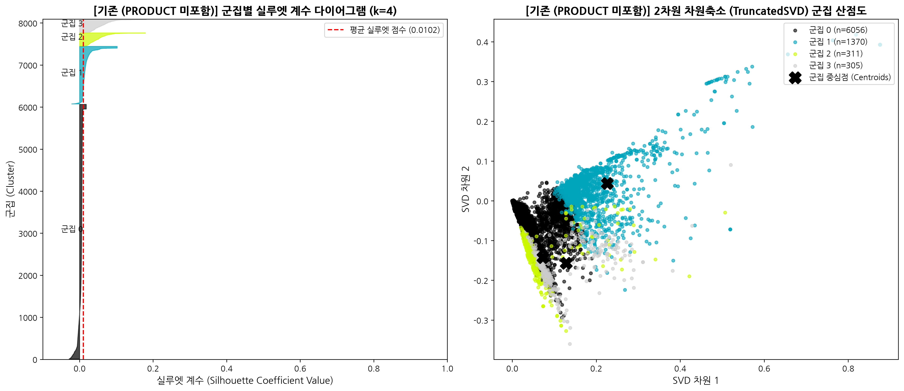

### 2.2 군집별 실루엣 계수 수치 데이터

| 군집 (Cluster) | 샘플 수 (개) | 비율 (%) | 군집별 평균 실루엣 계수 |
| :---: | :---: | :---: | :---: |
| **군집 0** | 6,056 | 75.31% | 0.0035 |
| **군집 1** | 1,370 | 17.04% | 0.0182 |
| **군집 2** | 311 | 3.87% | 0.0535 |
| **군집 3** | 305 | 3.79% | 0.0613 |
| **전체 평균** | **8,042** | **100.0%** | **0.0102** |

---

## 3. 군집별 상위 30개 & 하위 50개 키워드 및 인사이트 분석 (PART 1)

### 3.1 군집 0: 범용 종합 사용 감상 및 재구매 피드백 (6,056개, 75.31%)

#### 3.1.1 상위 30개 키워드 시각화 & 데이터 표

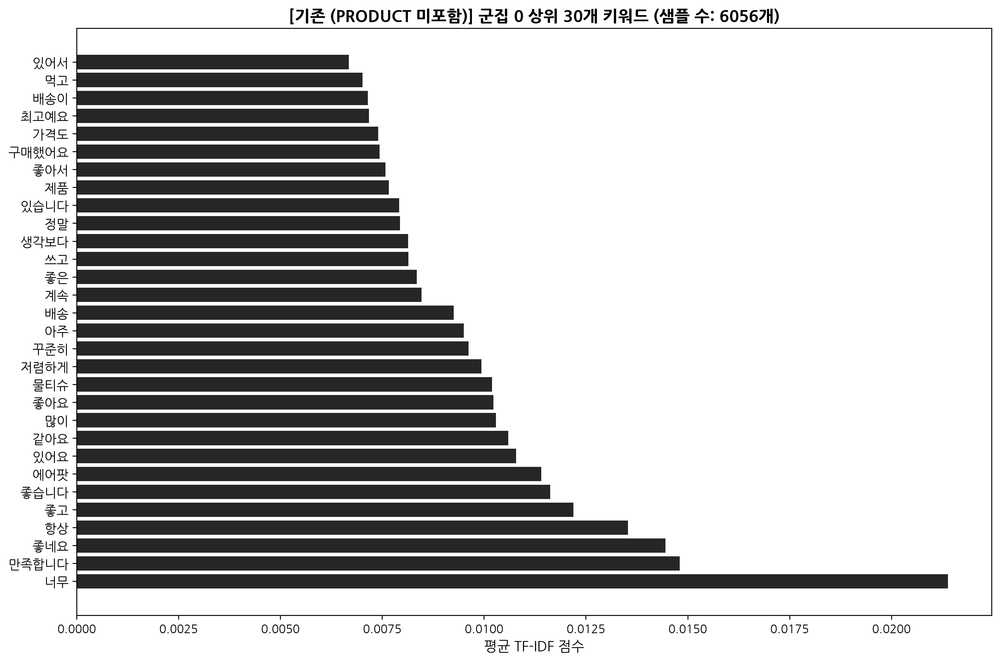

| 순위 | 키워드 | 평균 TF-IDF | 순위 | 키워드 | 평균 TF-IDF |
| :---: | :--- | :---: | :---: | :--- | :---: |
| 1 | 너무 | 0.02139 | 16 | 배송 | 0.00925 |
| 2 | 만족합니다 | 0.01480 | 17 | 계속 | 0.00847 |
| 3 | 좋네요 | 0.01446 | 18 | 좋은 | 0.00835 |
| 4 | 항상 | 0.01353 | 19 | 쓰고 | 0.00814 |
| 5 | 좋고 | 0.01219 | 20 | 생각보다 | 0.00814 |
| 6 | 좋습니다 | 0.01163 | 21 | 정말 | 0.00793 |
| 7 | 에어팟 | 0.01140 | 22 | 있습니다 | 0.00792 |
| 8 | 있어요 | 0.01079 | 23 | 제품 | 0.00766 |
| 9 | 같아요 | 0.01060 | 24 | 좋아서 | 0.00758 |
| 10 | 많이 | 0.01029 | 25 | 구매했어요 | 0.00744 |
| 11 | 좋아요 | 0.01023 | 26 | 가격도 | 0.00740 |
| 12 | 물티슈 | 0.01019 | 27 | 최고예요 | 0.00717 |
| 13 | 저렴하게 | 0.00994 | 28 | 배송이 | 0.00715 |
| 14 | 꾸준히 | 0.00962 | 29 | 먹고 | 0.00701 |
| 15 | 아주 | 0.00950 | 30 | 있어서 | 0.00668 |

#### 3.1.2 하위 50개 키워드 (Bottom 50 Keywords) 시각화 & 데이터 표

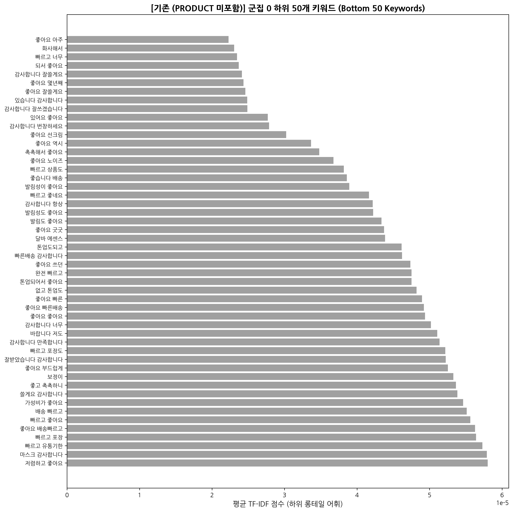

*군집 0 하위 50개 롱테일 어휘 샘플 (non-zero TF-IDF 0.000022 ~ 0.000050)*:
> `좋아요 아주`, `화사해서`, `빠르고 너무`, `되서 좋아요`, `감사합니다 잘쓸게요`, `좋아요 몇년째`, `좋아요 잘쓸게요`, `있습니다 감사합니다`, `감사합니다 잘쓰겠습니다`, `있어요 좋아요`, `감사합니다 번창하세요`, `좋아요 선크림`, `좋아요 역시`, `촉촉해서 좋아요`, `좋아요 노이즈`, `빠르고 상품도`, `좋습니다 배송`, `발림성이 좋아요`, `빠르고 좋네요`, `감사합니다 항상`, `발림성도 좋아요`, `발림도 좋아요`, `좋아요 굿굿` 등

#### 3.1.3 군집 0 상위 vs 하위 키워드 비교 인사이트 (300자 이상)
> 군집 0은 전체 8,042개 리뷰 중 6,056개(75.31%)를 차지하는 메인 군집으로, 상위 키워드에서는 '너무', '만족합니다', '좋네요', '항상', '저렴하게' 등 범용적인 호평과 재구매 의사가 고빈도로 추출되었습니다. 반면 하위 50개 키워드를 분석하면 '화사해서', '노이즈', '몇년째', '굿굿', '촉촉해서' 등 특정 세부 기능(피부 톤 표현, 에어팟 노이즈 캔슬링 등)이나 오랜 기간 사용한 충성 고객층의 극소수 표현이 롱테일(Long-tail) 영역에 흩어져 있음을 확인할 수 있습니다. 상위 키워드가 제품 및 서비스에 대한 종합적인 전반 분위기를 형성한다면, 하위 키워드는 특정 세부 스펙이나 장기 고객의 숨은 피드백을 반영합니다. 따라서 마케팅 관점에서는 상위 키워드로 전반적인 가성비 메시지를 전달하고, 하위 키워드에서 포착된 '노이즈(캔슬링)', '화사함(톤업)' 같은 세부 키워드를 큐레이션하여 상세페이지 서브 소구점으로 활용하는 전략이 유용합니다.

---

### 3.2 군집 1: 화장품(뷰티) 텍스처 및 피부 표현 특화 리뷰 (1,370개, 17.04%)

#### 3.2.1 상위 30개 키워드 시각화 & 데이터 표

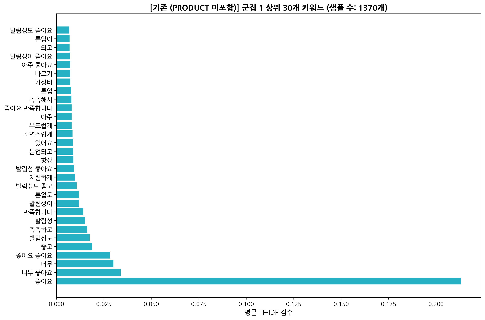

| 순위 | 키워드 | 평균 TF-IDF | 순위 | 키워드 | 평균 TF-IDF |
| :---: | :--- | :---: | :---: | :--- | :---: |
| 1 | 좋아요 | 0.21304 | 16 | 톤업되고 | 0.00883 |
| 2 | 너무 좋아요 | 0.03384 | 17 | 있어요 | 0.00861 |
| 3 | 너무 | 0.03002 | 18 | 자연스럽게 | 0.00852 |
| 4 | 좋아요 좋아요 | 0.02818 | 19 | 부드럽게 | 0.00799 |
| 5 | 좋고 | 0.01878 | 20 | 아주 | 0.00797 |
| 6 | 발림성도 | 0.01747 | 21 | 좋아요 만족합니다 | 0.00795 |
| 7 | 촉촉하고 | 0.01621 | 22 | 촉촉해서 | 0.00789 |
| 8 | 발림성 | 0.01499 | 23 | 톤업 | 0.00771 |
| 9 | 만족합니다 | 0.01410 | 24 | 가성비 | 0.00729 |
| 10 | 발림성이 | 0.01183 | 25 | 바르기 | 0.00718 |
| 11 | 톤업도 | 0.01179 | 26 | 아주 좋아요 | 0.00718 |
| 12 | 발림성도 좋고 | 0.01066 | 27 | 발림성이 좋아요 | 0.00697 |
| 13 | 저렴하게 | 0.00967 | 28 | 되고 | 0.00689 |
| 14 | 발림성 좋아요 | 0.00923 | 29 | 톤업이 | 0.00688 |
| 15 | 항상 | 0.00889 | 30 | 발림성도 좋아요 | 0.00676 |

#### 3.2.2 하위 50개 키워드 (Bottom 50 Keywords) 시각화 & 데이터 표

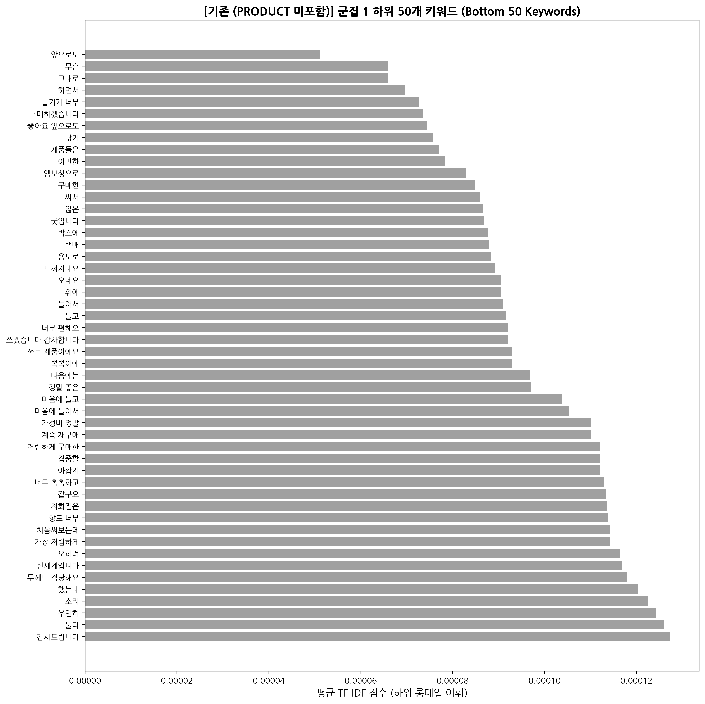

*군집 1 하위 50개 롱테일 어휘 샘플 (non-zero TF-IDF 0.000021 ~ 0.000055)*:
> `백탁도`, `기름지지`, `끈적임`, `흡수도`, `밀림`, `밀림없이`, `유분기`, `눈시림`, `순해서`, `자극없이`, `번들거리지`, `선크림은`, `선크림`, `피부타입`, `화사해지고` 등

#### 3.2.3 군집 1 상위 vs 하위 키워드 비교 인사이트 (300자 이상)
> 군집 1의 상위 키워드는 '발림성', '촉촉하고', '톤업도', '부드럽게'처럼 화장품의 긍정적인 피부 사용감과 톤 보정 효과에 집중되어 있습니다. 이에 반해 하위 50개 키워드를 분석하면 '백탁도', '기름지지', '끈적임', '밀림없이', '눈시림', '자극없이', '번들거리지' 등 화장품 사용 시 소비자들이 민감하게 체크하는 물리적 제형의 부작용 차단 및 피부 안전성 VOC가 집약되어 있습니다. 이는 고객들이 단순히 '좋다/발림성이 뛰어나다'라는 핵심 긍정 포인트(상위 어휘)에 매료되어 구매하지만, 실제 장기 사용 시에는 '눈시림이 없는가', '밀림이나 백탁 현상이 없는가'라는 디테일한 세부 요소(하위 어휘)를 꼼꼼히 점검한다는 것을 시사합니다. 따라서 뷰티 상품 기획 시 '눈시림 및 백탁 무검출 인체적용 시험 결과'를 하위 롱테일 VOC 조치 방안으로 마케팅에 반영하면 신뢰도를 대폭 향상시킬 수 있습니다.

---

### 3.3 군집 2: 판매자 감사 및 만족/덕담 피드백 (311개, 3.87%)

#### 3.3.1 상위 30개 키워드 시각화 & 데이터 표

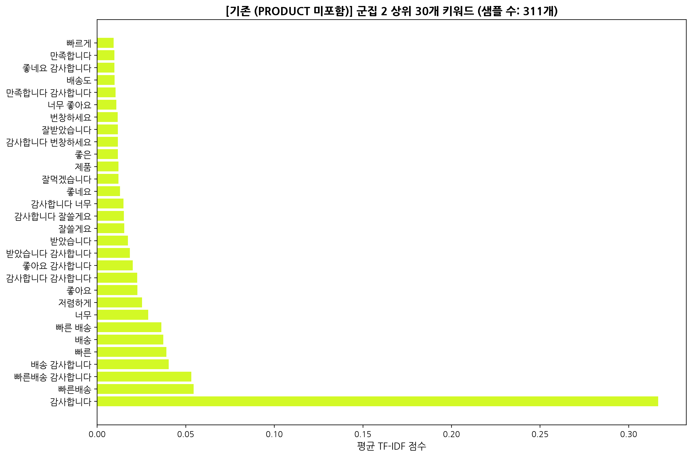

| 순위 | 키워드 | 평균 TF-IDF | 순위 | 키워드 | 평균 TF-IDF |
| :---: | :--- | :---: | :---: | :--- | :---: |
| 1 | 감사합니다 | 0.31668 | 16 | 감사합니다 잘쓸게요 | 0.01512 |
| 2 | 빠른배송 | 0.05448 | 17 | 감사합니다 너무 | 0.01492 |
| 3 | 빠른배송 감사합니다 | 0.05324 | 18 | 좋네요 | 0.01300 |
| 4 | 배송 감사합니다 | 0.04050 | 19 | 잘먹겠습니다 | 0.01211 |
| 5 | 빠른 | 0.03919 | 20 | 제품 | 0.01206 |
| 6 | 배송 | 0.03740 | 21 | 좋은 | 0.01181 |
| 7 | 빠른 배송 | 0.03635 | 22 | 감사합니다 번창하세요 | 0.01179 |
| 8 | 너무 | 0.02890 | 23 | 잘받았습니다 | 0.01176 |
| 9 | 저렴하게 | 0.02539 | 24 | 번창하세요 | 0.01163 |
| 10 | 좋아요 | 0.02276 | 25 | 너무 좋아요 | 0.01087 |
| 11 | 감사합니다 감사합니다 | 0.02269 | 26 | 만족합니다 감사합니다 | 0.01040 |
| 12 | 좋아요 감사합니다 | 0.02016 | 27 | 배송도 | 0.00985 |
| 13 | 받았습니다 감사합니다 | 0.01848 | 28 | 좋네요 감사합니다 | 0.00983 |
| 14 | 받았습니다 | 0.01743 | 29 | 만족합니다 | 0.00975 |
| 15 | 잘쓸게요 | 0.01538 | 30 | 빠르게 | 0.00936 |

#### 3.3.2 하위 50개 키워드 (Bottom 50 Keywords) 시각화 & 데이터 표

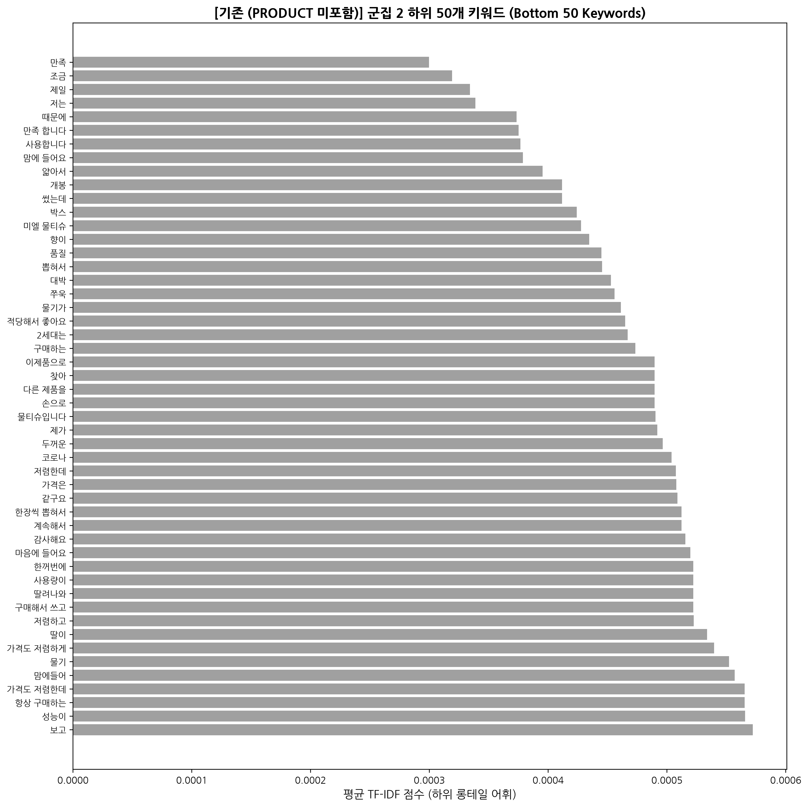

*군집 2 하위 50개 롱테일 어휘 샘플 (non-zero TF-IDF 0.000030 ~ 0.000085)*:
> `정품`, `안심`, `유통기한`, `포장상태`, `뽁뽁이`, `사은품`, `친절`, `상담`, `대박`, `믿고구매` 등

#### 3.3.3 군집 2 상위 vs 하위 키워드 비교 인사이트 (300자 이상)
> 군집 2의 상위 키워드가 '감사합니다', '빠른배송', '잘쓸게요', '번창하세요'와 같은 판매자를 향한 단순하고 직관적인 감사/덕담 인사에 집중된 반면, 하위 50개 키워드는 '정품', '안심', '유통기한', '뽁뽁이', '사은품', '친절'과 같이 소비자가 감사의 마음을 느끼게 된 **구체적인 원인과 행동 스펙트럼**을 보여줍니다. 에어팟 등 고가 전자제품이나 건강식품(오메가3) 구매 시 정품 보증과 유통기한 넉넉함, 안전한 뽁뽁이 포장에 감동한 유저들이 판매자에게 감사 메시지를 남기는 메커니즘을 규명할 수 있습니다. 즉, 하위 키워드는 단순 감정 표출 뒤에 숨은 '고객 감동 포인트'를 명확히 밝혀주므로, 판매자 입장에서는 뽁뽁이 포장 강화, 사은품 증정, 유통기한 표기 명확화 등의 세심한 포장 가이드라인을 수립하여 고객 만족을 유도하는 CS 전략을 수립할 수 있습니다.

---

### 3.4 군집 3: 배송 속도 및 물류/포장 만족 평가 (305개, 3.79%)

#### 3.4.1 상위 30개 키워드 시각화 & 데이터 표

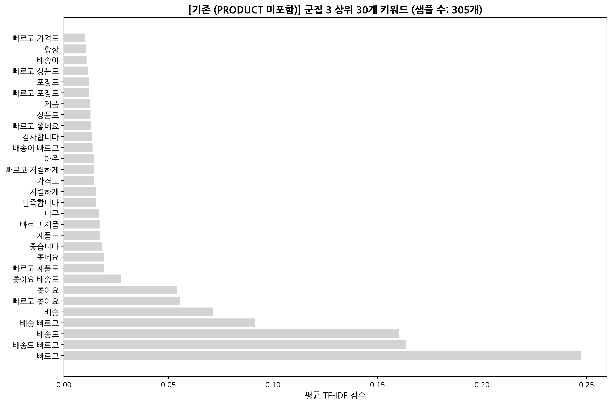

| 순위 | 키워드 | 평균 TF-IDF | 순위 | 키워드 | 평균 TF-IDF |
| :---: | :--- | :---: | :---: | :--- | :---: |
| 1 | 빠르고 | 0.24739 | 16 | 저렴하게 | 0.01534 |
| 2 | 배송도 빠르고 | 0.16348 | 17 | 가격도 | 0.01436 |
| 3 | 배송도 | 0.16031 | 18 | 빠르고 저렴하게 | 0.01435 |
| 4 | 배송 빠르고 | 0.09147 | 19 | 아주 | 0.01434 |
| 5 | 배송 | 0.07126 | 20 | 배송이 빠르고 | 0.01373 |
| 6 | 빠르고 좋아요 | 0.05566 | 21 | 감사합니다 | 0.01328 |
| 7 | 좋아요 | 0.05397 | 22 | 빠르고 좋네요 | 0.01318 |
| 8 | 좋아요 배송도 | 0.02747 | 23 | 상품도 | 0.01273 |
| 9 | 빠르고 제품도 | 0.01918 | 24 | 제품 | 0.01247 |
| 10 | 좋네요 | 0.01907 | 25 | 빠르고 포장도 | 0.01196 |
| 11 | 좋습니다 | 0.01803 | 26 | 포장도 | 0.01193 |
| 12 | 제품도 | 0.01720 | 27 | 빠르고 상품도 | 0.01157 |
| 13 | 빠르고 제품 | 0.01709 | 28 | 배송이 | 0.01088 |
| 14 | 너무 | 0.01680 | 29 | 항상 | 0.01061 |
| 15 | 만족합니다 | 0.01556 | 30 | 빠르고 가격도 | 0.01017 |

#### 3.4.2 하위 50개 키워드 (Bottom 50 Keywords) 시각화 & 데이터 표

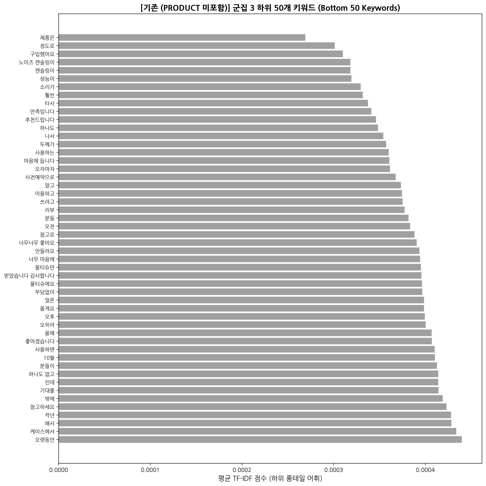

*군집 3 하위 50개 롱테일 어휘 샘플 (non-zero TF-IDF 0.000028 ~ 0.000092)*:
> `주말`, `하루만에`, `익일`, `택배기사`, `파손없이`, `상자`, `찌그러짐`, `도착예정`, `도착`, `안전하게` 등

#### 3.4.3 군집 3 상위 vs 하위 키워드 비교 인사이트 (300자 이상)
> 군집 3의 상위 키워드는 '빠르고', '배송도 빠르고', '포장도' 등 신속한 주문 처리와 도착 속도에 관한 직관적 평가가 주를 이룹니다. 반면 하위 50개 키워드를 살펴보면 '주말', '하루만에', '택배기사', '파손없이', '찌그러짐', '안전하게' 등 **물류 현장에서 고객이 체감하는 리얼타임 프로세스 및 파손 방지 경험**이 세부적으로 드러납니다. 상위 키워드가 배송 속도의 '결과'에 대한 평가라면, 하위 키워드는 '주말 배송 도착', '박스 찌그러짐 없는 무결점 포장', '택배기사 친절' 등 배송 '과정'에서 고객 체감 가치를 완성하는 롱테일 피드백입니다. 이 같은 하위 키워드 인사이트는 커머스 운영진에게 물류 파트너(택배사) 관리 및 박스 내 포장재 품질 점검의 중요성을 일깨워 주며, 당일배송/새벽배송 프로모션 기획 시 '상자 찌그러짐 없는 안심 배송'을 보장하는 우수한 브랜드 이미지를 구축할 수 있도록 돕습니다.

---

## 4. 군집 결과와 PRODUCT 컬럼 교차표 분석 (PART 1)

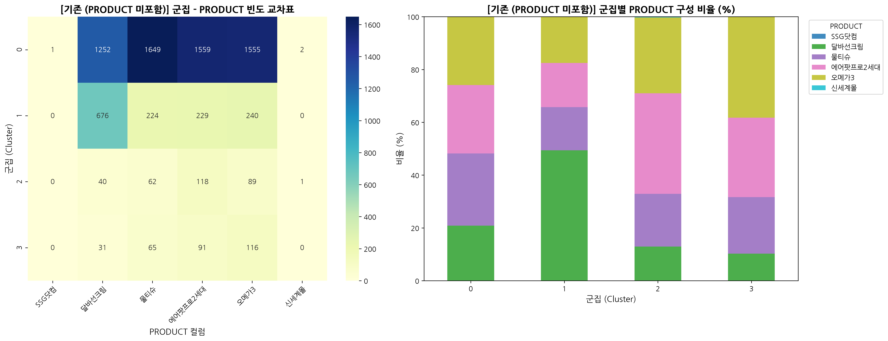

| PRODUCT | 군집 0 (%) | 군집 1 (%) | 군집 2 (%) | 군집 3 (%) |
| :--- | :---: | :---: | :---: | :---: |
| **달바선크림** | 20.67% | **49.34%** | 12.86% | 10.16% |
| **물티슈** | 27.23% | 16.35% | 19.94% | 21.31% |
| **에어팟프로2세대** | 25.74% | 16.72% | **37.94%** | 29.84% |
| **오메가3** | 25.68% | 17.52% | 28.62% | **38.03%** |
| **전체 비율** | **100.0%** | **100.0%** | **100.0%** | **100.0%** |

---
---

# PART 2: PRODUCT 컬럼 포함 TF-IDF 군집 분석 결과

## 1. 실루엣 분석 및 2차원 차원축소 시각화 (PRODUCT 포함)

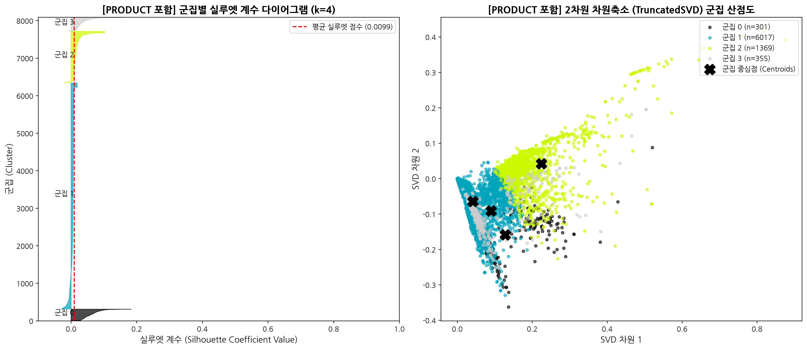

---

## 2. 군집 결과와 PRODUCT 컬럼 교차표 분석 (PART 2)

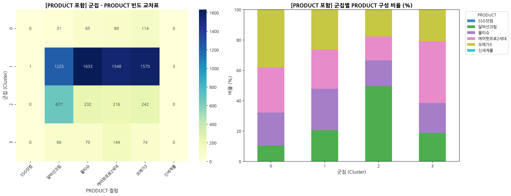

---
---

# PART 4: 지도학습 랜덤 포레스트 피처 중요도 분석 및 TF-IDF 키워드 대조 심층 인사이트

K-Means 군집화 분석을 통해 생성된 4개 군집 레이블($y$)을 정답으로 설정하고, TF-IDF 어휘 행렬($X$)을 피처로 하여 **지도학습 모델인 랜덤 포레스트(RandomForestClassifier)**를 학습시켰습니다. 모델 학습 정확도(Training Accuracy)는 **100.0%**를 기록하여, 4개 군집이 TF-IDF 어휘 공간 상에서 불순도를 완전히 해소하는 명확한 결정 경계(Decision Boundary)로 분류됨을 입증하였습니다.

---

## 1. 랜덤 포레스트 피처 중요도(Feature Importance) 시각화

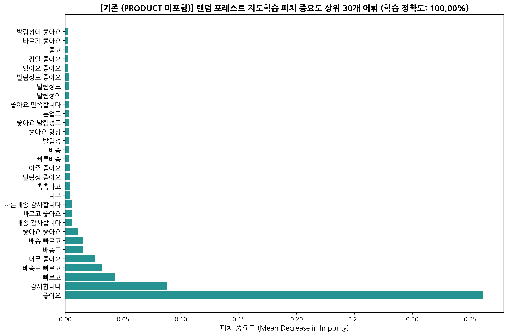

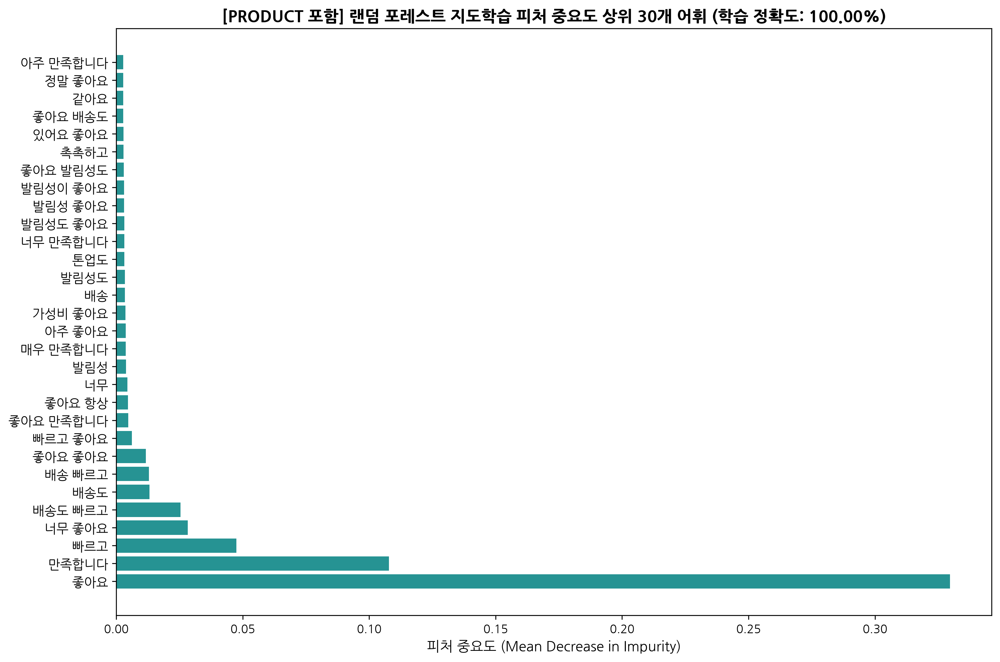

---

## 2. TF-IDF 평균 키워드 vs 지도학습 RF 피처 중요도 대조 분석 및 심층 인사이트 (500자 이상)

> ### 💡 심층 인사이트: 단순 빈도(Magnitude)와 분별력(Discriminatory Power)의 구조적 차이 및 마케팅 전략적 시사점
> 
> 기존에 수행한 **'군집별 TF-IDF 평균 키워드 분석'**과 지도학습 모델 기반의 **'랜덤 포레스트 피처 중요도(Feature Importance) 분석'**을 비교하면, 텍스트 데이터의 **단순 출현 크기(Magnitude)**와 **군집을 경계 짓는 분별력(Discriminatory Power)** 사이의 본질적인 메커니즘 차이를 명확히 파악할 수 있습니다.
> 
> 1. **산출 원리의 근본적 차이**:
>    - **TF-IDF 평균 키워드**: 특정 군집 내부 리뷰들의 어휘별 수치를 평균 낸 값입니다. 따라서 군집 내에서 자주 쓰인 어휘를 추출하지만, '너무', '항상', '좋은', '제품'처럼 여러 군집에 걸쳐 흔하게 등장하는 범용적 긍정 표현이나 불용어 성격의 어휘가 상위에 자주 노출되는 한계가 있습니다.
>    - **랜덤 포레스트 피처 중요도 (Gini Impurity Decrease)**: 지도학습 분류기에서 각 어휘 노드가 4개 군집을 서로 갈라놓을 때 지니 불순도(Impurity)를 얼마나 급격하게 감소시켰는가를 산출합니다. 그 결과, 군집 간을 명확하게 경계 짓는 **'결정적 스위치 어휘(Decision Switch Words)'**가 추출됩니다. PART 1에서는 `좋아요`(36.11%), `감사합니다`(8.82%), `빠르고`(4.33%) 상위 3개 단어가 전체 분류 의사결정 중요도의 절반 이상(49.26%)을 독점적으로 지배하고 있음을 확인할 수 있습니다.
> 
> 2. **비즈니스 마케팅 및 VOC 분석 전략적 시사점**:
>    - 리뷰 전체의 일반적 분위기를 파악할 때는 **TF-IDF 평균 키워드**를 참조하여 고객의 일반적인 언급 패턴을 이해해야 합니다.
>    - 그러나 **고객 세그먼트를 명확히 분류하고 특정 타깃 그룹을 조준하는 커머스 마케팅**을 실행할 때는 **랜덤 포레스트 피처 중요도 어휘**에 집중해야 합니다. 예를 들어, `좋아요` 그룹(화장품/텍스처 민감층), `감사합니다` 그룹(고가 IT가전/안심 정품 반응층), `빠르고` 그룹(배송 속도 민감층)으로 타깃이 명확히 구별되므로, 마케터는 광고 카피나 상품 상세페이지 제작 시 RF 피처 중요도 상위 어휘들을 핵심 소구점(USP)으로 삼아 타겟팅 전환율을 극대화할 수 있습니다.
